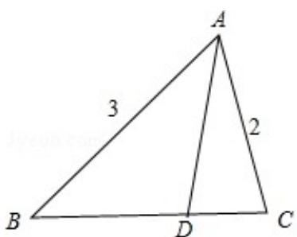

> [!faq]- 2017年天津高考文科数学试题及答案(Word版)解析
>
> > [!success]- **【答案】** 为: $\frac{3}{11}$ .  【点评】本题考查了平面向量的线性运算与数量积运算问题，是中档题. ##
>
> > [!note]- **【分析】**
> > 根据题意画出图形，结合图形，利用 $\overrightarrow{AB}$ 、 $\overrightarrow{AC}$ 表示出 $\overrightarrow{AD}$ ，
>
> > [!note]- **【解析】**
> > 分析】根据题意画出图形，结合图形，利用 $\overrightarrow{AB}$ 、 $\overrightarrow{AC}$ 表示出 $\overrightarrow{AD}$ ，
> >
> > 再根据平面向量的数量积 $\overrightarrow{\mathrm{AD}}\cdot \overrightarrow{\mathrm{AE}}$ 列出方程求出 $\lambda$ 的值.
> >
> > 【
> > 解答】解：如图所示，
> >
> > △ABC 中，∠A=60°，AB=3，AC=2，
> >
> > $\overrightarrow{BD} = 2\overrightarrow{DC},$
> >
> > $$
> > \therefore \overrightarrow {A D} = \overrightarrow {A B} + \overrightarrow {B D}
> > $$
> >
> > $$
> > = \overrightarrow {A B} + \frac {2}{3} \overrightarrow {B C}
> > $$
> >
> > $$
> > = \overrightarrow {A B} + \frac {2}{3} (\overrightarrow {A C} - \overrightarrow {A B})
> > $$
> >
> > $$
> > = \frac {1}{3} \overrightarrow {A B} + \frac {2}{3} \overrightarrow {A C},
> > $$
> >
> > 又 $\overrightarrow{AE} = \lambda \overrightarrow{AC} -\overrightarrow{AB}$ （ $\lambda \in R$ ）
> >
> > $$
> > \therefore \overrightarrow {A D} \cdot \overrightarrow {A E} = (\frac {1}{3} \overrightarrow {A B} + \frac {2}{3} \overrightarrow {A C}) \cdot (\lambda \overrightarrow {A C} - \overrightarrow {A B})
> > $$
> >
> > $$
> > = \left(\frac {1}{3} \lambda - \frac {2}{3}\right) \overrightarrow {A B} \cdot \overrightarrow {A C} - \frac {1}{3} \overrightarrow {A B} ^ {2} + \frac {2}{3} \lambda \overrightarrow {A C} ^ {2}
> > $$
> >
> > $$
> > = \left(\frac {1}{3} \lambda - \frac {2}{3}\right) \times 3 \times 2 \times \cos 6 0 ^ {\circ} - \frac {1}{3} \times 3 ^ {2} + \frac {2}{3} \lambda \times 2 ^ {2} = - 4,
> > $$
> >
> > $$
> > \therefore \frac {1 1}{3} \lambda = 1,
> > $$
> >
> > 解得 $\lambda=\frac{3}{11}$ .
> >
> > 故
> > 答案为: $\frac{3}{11}$ .
> >
> > 
> >
> > 【点评】本题考查了平面向量的线性运算与数量积运算问题，是中档题.
> >
> > ##
