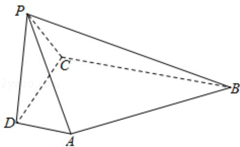

<!-- question-source:start -->
17．（13分）如图，在四棱锥P-ABCD中，AD⊥平面

PDC, AD∥BC, PD⊥ PB, AD=1, BC=3, CD=4, PD=2.

（Ⅰ）求异面直线 AP 与 BC 所成角的余弦值；

（Ⅱ）求证：PD⊥平面PBC；

（III）求直线 AB 与平面 PBC 所成角的正弦值.

<!-- question-source:end -->

![[高中/真题/按年份分类/2017/2017年天津高考文科数学试题及答案_Word版_/解答题/题目/answers/Q00023697A1.md]]
