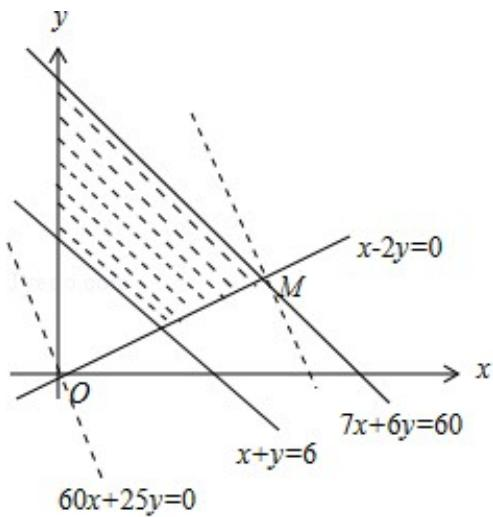

> [!faq]- 2017年天津高考文科数学试题及答案(Word版)解析
>
> > [!success]- **【答案】** . 【
>
> > [!note]- **【分析】**
> > （Ⅰ）直接由题意结合图表列关于 x, y 所满足得不等式组，化简后即可画
>
> > [!note]- **【解析】**
> > （Ⅰ）解：由已知，x，y 满足的数学关系式为 $\left\{\begin{aligned}&70x+60y\leqslant600\\ &5x+5y\geqslant30\\&x\leqslant2y\\&x\geqslant0\\&y\geqslant0\end{aligned}\right.$ ，即
> >
> > $$
> > \left\{ \begin{array}{l} 7 x + 6 y \leqslant 6 0 \\ x + y \geqslant 6 \\ x - 2 y \leqslant 0 \\ x \geqslant 0 \\ y \geqslant 0 \end{array} . \right.
> > $$
> >
> > 该二元一次不等式组所表示的平面区域如图：
> >
> > 
> >
> > （Ⅱ）解：设总收视人次为 z 万，则目标函数为 $z=60x+25y$ .
> >
> > 考虑 $z = 60x + 25y$ ，将它变形为 $y = \frac{12}{5} x + \frac{z}{25}$ ，这是斜率为 $-\frac{12}{5}$ ，随 $z$ 变化的一族平行直线.
> >
> > $\frac{z}{25}$ 为直线在 $y$ 轴上的截距，当 $\frac{z}{25}$ 取得最大值时， $z$ 的值最大.
> >
> > 又∵x，y满足约束条件，
> >
> > ∴由图可知，当直线 $z=60x+25y$ 经过可行域上的点 M 时，截距 $\frac{z}{25}$ 最大，即 z 最大.
> > 解方程组 $\left\{\begin{aligned}&7x+6y=60\\ &x-2y=0\end{aligned}\right.$ ，得点M的坐标为（6，3）.
> >
> > ∴电视台每周播出甲连续剧6次、乙连续剧3次时才能使总收视人次最多.
> >
> > 【点评】本题考查解得线性规划的应用，考查数学建模思想方法及数形结合的解
> >
> > 题思想方法，是中档题。
