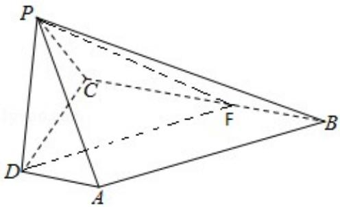

> [!faq]- 2017年天津高考文科数学试题及答案(Word版)解析
>
> > [!success]- **【答案】** 详见解析
>
> > [!note]- **【分析】**
> > （Ⅰ）由已知 AD∥BC，从而∠DAP 或其补角即为异面直线 AP 与 BC 所成的
>
> > [!note]- **【解析】**
> > 解：（Ⅰ）如图，由已知 AD∥BC，
> >
> > 故∠DAP或其补角即为异面直线AP与BC所成的角.
> >
> > 因为 AD⊥平面 PDC，所以 AD⊥PD.
> >
> > 在 Rt△PDA 中，由已知，得 $AP=\sqrt{AD^{2}+PD^{2}}=\sqrt{5}$ ，
> >
> > 故 $\cos\angle DAP=\frac{AD}{AP}=\frac{\sqrt{5}}{5}.$
> >
> > 所以，异面直线AP与BC所成角的余弦值为 $\frac{\sqrt{5}}{5}$
> >
> > 证明：（II）因为 AD⊥平面 PDC，直线 PDC 平面 PDC，
> >
> > 所以 AD⊥PD.
> >
> > 又因为 BC∥AD，所以 PD⊥BC，
> >
> > 又 PD⊥PB，所以 PD⊥平面 PBC.
> >
> > 解：（III）过点 D 作 AB 的平行线交 BC 于点 F，连结 PF，
> >
> > 则 DF 与平面 PBC 所成的角等于 AB 与平面 PBC 所成的角.
> >
> > 因为 PD⊥平面 PBC，故 PF 为 DF 在平面 PBC 上的射影，
> >
> > 所以 $\angle DFP$ 为直线 DF 和平面 PBC 所成的角.
> >
> > 由于 AD∥BC，DF∥AB，故 BF=AD=1，
> >
> > 由已知，得 $CF = BC - BF = 2$ 。又 $AD \perp DC$ ，故 $BC \perp DC$ ，
> >
> > 在 Rt△DCF 中，可得 $\sin\angle DFP=\frac{PD}{DF}=\frac{\sqrt{5}}{5}$ .
> >
> > 所以，直线 AB 与平面 PBC 所成角的正弦值为 $\frac{\sqrt{5}}{5}$ .
> >
> > 
> >
> > 【点评】本小题主要考查两条异面直线所成的角、直线与平面垂直、直线与平面所成的角等基础知识。考查空间想象能力、运算求解能力和推理论证能力，是中档题。
