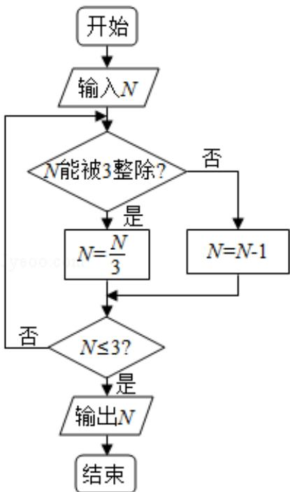

<!-- question-source:start -->
4.（5 分）阅读如图的程序框图，运行相应的程序，若输入 N 的值为 19，则输出 N 的值为（）

A. 0B. 1C. 2D. 3
<!-- question-source:end -->

![[高中/真题/按年份分类/2017/2017年天津高考文科数学试题及答案_Word版_/选择题/题目/answers/Q00023684A1.md]]
