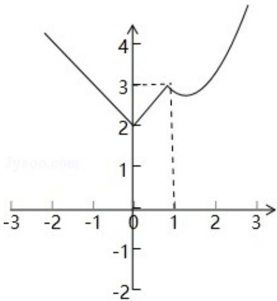

> [!faq]- 2017年天津高考文科数学试题及答案(Word版)解析
>
> > [!success]- **【答案】** A
>
> > [!note]- **【分析】**
> > 根据题意,作出函数 $f(x)$ 的图象,令 $g(x)=\left|\frac{x}{2}+a\right|$ ,
>
> > [!note]- **【解析】**
> > 分析】根据题意,作出函数 $f(x)$ 的图象,令 $g(x)=\left|\frac{x}{2}+a\right|$ ,
> >
> > 分析 $g(x)$ 的图象特点,将不等式 $f(x) \geqslant \left|\frac{x}{2} + a\right|$ 在 $R$ 上恒成立转化为函数 $f(x)$ 的图象在 $g(x)$ 上的上方或相交的问题，
> > 分析可得 $f(0) \geqslant g(0)$ ，即 $2 \geq |a|$ ，解可得 $a$ 的取值范围，即可得答
> >
> > 案.
> >
> > 【
> > 解答】解：根据题意，函数 $f(x) = \begin{cases} |x| + 2, & x < 1 \\ x + \frac{2}{x}, & x \geqslant 1. \end{cases}$ 的图象如图：
> >
> > 令 $g(x) = \left|\frac{x}{2} + a\right|$ ，其图象与 $x$ 轴相交与点（-2a，0），
> >
> > 在区间 $(- \infty, -2a)$ 上为减函数，在 $(-2a, +\infty)$ 为增函数，
> >
> > 若不等式 $f(x) \geqslant \left|\frac{x}{2} + a\right|$ 在 $R$ 上恒成立，则函数 $f(x)$ 的图象在
> >
> > g (x) 上的上方或相交，
> >
> > 则必有 $f(0) \geqslant g(0)$ ，
> >
> > 即 $2 \geq |a|$ ，
> >
> > 解可得 $-2 \leq a \leq 2$ ,
> >
> > 故选：A.
> >
> > 
> >
> > 【点评】本题考查分段函数的应用,关键是作出函数 $f(x)$ 的图象,将函数的恒成立
> > 问题转化为图象的上下位置关系.
> >
> > ## 二、填空题：本大题共6小题，每小题5分，共30分.
