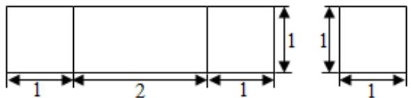
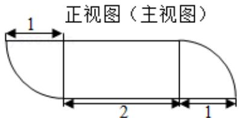

<!-- question-source:start -->
13.（5分）由一个长方体和两个 $\frac{1}{4}$ 圆柱体构成的几何体的三视图如图，则该几何

体的体积为\_\_\_\_。

  
俯视图
<!-- question-source:end -->

![[高中/真题/按年份分类/2017/2017年山东省高考数学试卷_理科_word版试卷及解析/填空题/题目/answers/Q00025766A1.md]]
