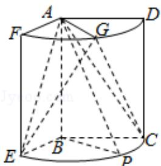

<!-- question-source:start -->
17. (12 分) 如图, 几何体是圆柱的一部分, 它是由矩形 ABCD (及其内部) 以 AB 边所在直线为旋转轴旋转 $120^{\circ}$ 得到的, G 是 $\widehat{DF}$ 的中点.

（Ⅰ）设 P 是 $\widehat{CE}$ 上的一点，且 AP⊥BE，求 $\angle CBP$ 的大小；

（II）当 AB=3，AD=2 时，求二面角 E-AG-C 的大小.

<!-- question-source:end -->

![[高中/真题/按年份分类/2017/2017年山东省高考数学试卷_理科_word版试卷及解析/填空题/题目/answers/Q00025770A1.md]]
