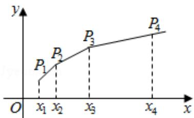

<!-- question-source:start -->
19. （12分）已知 $\{\mathbf{x}_{\mathrm{n}}\}$ 是各项均为正数的等比数列，且 $x_{1} + x_{2} = 3$ ， $x_{3} - x_{2} = 2$

（Ⅰ）求数列 $\{x_{n}\}$ 的通项公式；

（II）如图，在平面直角坐标系 xOy 中，依次连接点 $P_{1}(x_{1}, 1)$ ， $P_{2}(x_{2}, 2)$ … $P_{n+1}(x_{n+1}, n+1)$ 得到折线 $P_{1}P_{2}\ldots P_{n+1}$ ，求由该折线与直线 y=0, $x=x_{1}$ , $x=x_{n+1}$ 所围成的区域的面积 $T_{n}$ .

<!-- question-source:end -->

![[高中/真题/按年份分类/2017/2017年山东省高考数学试卷_理科_word版试卷及解析/填空题/题目/answers/Q00025772A1.md]]
