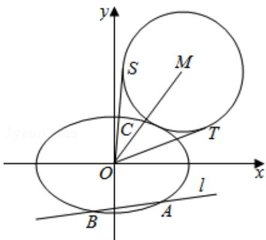

<!-- question-source:start -->
21. (14 分) 在平面直角坐标系 xOy 中, 椭圆 E: $\frac{x^2}{a^2} + \frac{y^2}{b^2} = 1 (a > b > 0)$ 的离心率为

$\frac{\sqrt{2}}{2}$ ，焦距为2.

(Ⅰ) 求椭圆 E 的方程.

（II）如图，该直线 $l: y = k_1 x - \frac{\sqrt{3}}{2}$ 交椭圆 $E$ 于 $A, B$ 两点， $C$ 是椭圆 $E$ 上的一点，直线 $OC$ 的斜率为 $k_2$ ，且看 $k_1 k_2 = \frac{\sqrt{2}}{4}$ ， $M$ 是线段 $OC$ 延长线上一点，且 $|MC|: |AB| = 2$ :

3, $\odot M$ 的半径为 $|MC|$ , OS, OT 是 $\odot M$ 的两条切线, 切点分别为 S, T, 求 $\angle SOT$ 的

最大值，并求取得最大值时直线I的斜率.

# 2017 年山东省高考数学试卷（理科）

参考
<!-- question-source:end -->

![[高中/真题/按年份分类/2017/2017年山东省高考数学试卷_理科_word版试卷及解析/填空题/题目/answers/Q00025774A1.md]]
