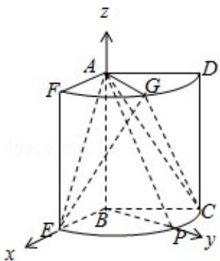
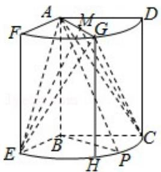

> [!faq]- 2017年山东省高考数学试卷(理科)word版试卷及解析解析
>
> > [!success]- **【答案】** 0
>
> > [!note]- **【分析】**
> > 本题解析推导如下：
>
> > [!note]- **【解析】**
> > 解：（Ⅰ）∵AP⊥BE，AB⊥BE，且AB，AP⊂平面ABP，AB∩AP=A，
> >
> > ∴BE⊥平面 ABP，又 BPC 平面 ABP，
> >
> > ∴BE⊥BP，又∠EBC=120°，
> >
> > 因此 $\angle CBP=30^{\circ}$ ;
> >
> > （Ⅱ）解法
> > 一、
> >
> > 取 $\widehat{EC}$ 的中点H，连接EH，GH，CH，
> >
> > ∵∠EBC=120°，∴四边形 BECH 为菱形，
> >
> > $$
> > \therefore A E = G E = A C = G C = \sqrt {3 ^ {2} + 2 ^ {2}} = \sqrt {1 3}.
> > $$
> >
> > 取 AG 中点 M，连接 EM，CM，EC，
> >
> > 则 EM⊥AG，CM⊥AG， ∴∠EMC为所求二面角的平面角.
> >
> > 又 AM=1，∴ EM=CM= $\sqrt{13-1}=2\sqrt{3}$ .
> >
> > 在 $\triangle BEC$ 中，由于 $\angle EBC=120^{\circ}$ ，
> >
> > 由余弦定理得： $EC^{2}=2^{2}+2^{2}-2\times2\times2\times\cos120^{\circ}=12$ ，
> >
> > $\therefore \mathrm{EC} = 2\sqrt{3}$ ，因此 $\triangle \mathrm{EMC}$ 为等边三角形，
> >
> > 故所求的角为 $60^{\circ}$ .
> >
> > 解法
> > 二、以 B 为坐标原点，分别以 BE, BP, BA 所在直线为 x, y, z 轴建立空间直角
> >
> > 坐标系.
> >
> > 由题意得：A（0，0，3），E（2，0，0），G（1， $\sqrt{3}$ ，3），C（-1， $\sqrt{3}$ ，0），
> >
> > 故 $\overrightarrow{AE} = (2, 0, -3)$ , $\overrightarrow{AG} = (1, \sqrt{3}, 0)$ , $\overrightarrow{CG} = (2, 0, 3)$ .
> >
> > 设 $\vec{\mathfrak{m}} = (\mathbf{x}_1, \mathbf{y}_1, \mathbf{z}_1)$ 为平面AEG的一个法向量，
> >
> > 由 $\left\{\begin{aligned}\overrightarrow{m}&\cdot\overrightarrow{AE}=0\\ \overrightarrow{m}&\cdot\overrightarrow{AG}=0\end{aligned}\right.$ ，得 $\left\{\begin{aligned}2x_{1}-3z_{1}=0\\ x_{1}+\sqrt{3}y_{1}=0\end{aligned}\right.$ ，取 $z_{1}=2$ ，得 $\overrightarrow{m}=(3,-\sqrt{3},2)$ ；
> >
> > 设 $\vec{\mathrm{n}} = (\mathrm{x}_2, \mathrm{y}_2, \mathrm{z}_2)$ 为平面ACG的一个法向量，
> >
> > 由 $\left\{\begin{aligned}\overrightarrow{n}&\cdot\overrightarrow{AG}=0\\ \overrightarrow{n}&\cdot\overrightarrow{CG}=0\end{aligned}\right.$ ，可得 $\left\{\begin{aligned}x_{2}&+\sqrt{3}y_{2}=0\\ 2x_{2}&+3z_{2}=0\end{aligned}\right.$ ，取 $z_{2}=-2$ ，得 $\overrightarrow{n}=(3,-\sqrt{3},-2)$ 。
> >
> > $\therefore \cos < \underset{\mathrm{m}}{\rightarrow}, \underset{\mathrm{n}}{\rightarrow} > = \frac{\underset{\mathrm{m}}{\rightarrow} \cdot \underset{\mathrm{n}}{\rightarrow}}{|\underset{\mathrm{m}}{\rightarrow}| |\underset{\mathrm{n}}{\rightarrow}|} = \frac{1}{2}$ .
> >
> > ∴二面角 E - AG - C 的大小为 $60^{\circ}$ .
> >
> > 
> >
> > 
