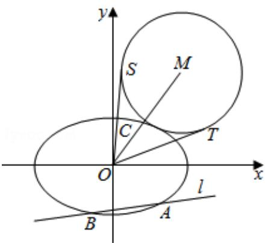

> [!faq]- 2017年山东省高考数学试卷(理科)word版试卷及解析解析
>
> > [!success]- **【答案】** (14 分)
>
> > [!note]- **【分析】**
> > 本题解析推导如下：
>
> > [!note]- **【解析】**
> > 解：（Ⅰ）由题意知， $\left\{\begin{aligned}\frac{c}{a}&=\frac{\sqrt{2}}{2}\\ 2c&=2\\ a^{2}&=b^{2}+c^{2}\end{aligned}\right.$ ，解得 $a=\sqrt{2}$ ，b=1。
> >
> > ∴椭圆 E 的方程为 $\frac{x^{2}}{2} + y^{2} = 1$ ;
> >
> > （Ⅱ）设 A $(x_{1}, y_{1})$ ，B $(x_{2}, y_{2})$ ，
> >
> > 联立 $\left\{ \begin{array}{l} \frac{x^2}{2} + y^2 = 1 \\ y = k_1 x - \frac{\sqrt{3}}{2} \end{array} \right.$ ，得 $(4k_1^2 + 2)x^2 - 4\sqrt{3}k_1x - 1 = 0$ 。
> >
> > 由题意得 $\triangle = 64k_{1}^{2} + 8 > 0$
> >
> > $$
> > \mathrm{x} _ {1} + \mathrm{x} _ {2} = \frac {2 \sqrt {3} \mathrm{k} _ {1}}{2 \mathrm{k} _ {1} ^ {2} + 1}, \quad \mathrm{x} _ {1} \mathrm{x} _ {2} = - \frac {1}{2 (2 \mathrm{k} _ {1} ^ {2} + 1)}.
> > $$
> >
> > $$
> > \therefore | A B | = \sqrt {1 + k _ {1} ^ {2}} | x _ {1} - x _ {2} | = \sqrt {2} \cdot \frac {\sqrt {1 + k _ {1} ^ {2}} \sqrt {1 + 8 k _ {1} ^ {2}}}{1 + 2 k _ {1} ^ {2}}.
> > $$
> >
> > 由题意可知圆 M 的半径 r 为
> >
> > $$
> > r = \frac {2}{3} | A B | = \frac {2 \sqrt {2} \sqrt {1 + k _ {1} ^ {2}} \sqrt {1 + 8 k _ {1} ^ {2}}}{1 + 2 k _ {1} ^ {2}}.
> > $$
> >
> > 由题意设知， $k_{1}k_{2}=\frac{\sqrt{2}}{4},\therefore k_{2}=\frac{\sqrt{2}}{4k_{1}}.$
> >
> > 因此直线 OC 的方程为 $y=\frac{\sqrt{2}}{4k_{1}}x$ .
> >
> > 联立 $\left\{ \begin{array}{l} \frac{x^2}{2} + y^2 = 1 \\ y = \frac{\sqrt{2}}{4k_1} x \end{array} \right.$ ，得 $x^2 = \frac{8k_1^2}{1 + 4k_1^2}$ ， $y^2 = \frac{1}{1 + 4k_1^2}$ .
> >
> > 因此， $|\mathrm{OC}| = \sqrt{\mathbf{x}^2 + \mathbf{y}^2} = \sqrt{\frac{1 + 8\mathrm{k}_1^2}{1 + 4\mathrm{k}_1^2}}.$
> >
> > 由题意可知， $\sin\frac{\angle SOT}{2}=\frac{r}{r+|OC|}=\frac{1}{1+\frac{|OC|}{r}}$
> >
> > $$
> > \text {而} \frac {| O C |}{r} = \frac {\sqrt {\frac {1 + 8 k _ {1} ^ {2}}{1 + 4 k _ {1} ^ {2}}}}{\frac {2 \sqrt {2} \sqrt {1 + k _ {1} ^ {2}} \sqrt {1 + 8 k _ {1} ^ {2}}}{3}} = \frac {3 \sqrt {2}}{4} \frac {1 + 2 k _ {1} ^ {2}}{\sqrt {1 + 4 k _ {1} ^ {2}} \sqrt {1 + k _ {1} ^ {2}}}.
> > $$
> >
> > 令 $t = 1 + 2k_{1}^{2}$ ，则 $t > 1$ ， $\frac{1}{t}\in (0,1)$
> >
> > 因此， $\frac{|OC|}{r}=\frac{3}{2}\frac{t}{\sqrt{2t^{2}+t-1}}=\frac{3}{2}\frac{1}{\sqrt{2+\frac{1}{t}-\frac{1}{t^{2}}}}=\frac{3}{2}\frac{1}{\sqrt{-\left(\frac{1}{t}-\frac{1}{2}\right)^{2}+\frac{9}{4}}}\geq1.$
> >
> > 当且仅当 $\frac{1}{t} = \frac{1}{2}$ ，即 $t = 2$ 时等式成立，此时 $k_{1} = \pm \frac{\sqrt{2}}{2}$ .
> >
> > $\therefore \sin \frac{\angle SOT}{2} \leqslant \frac{1}{2}$ , 因此 $\frac{\angle SOT}{2} \leqslant \frac{\pi}{6}$ .
> >
> > ∴∠SOT的最大值为 $\frac{\pi}{3}$ .
> >
> > 综上所述： $\angle \mathrm{SOT}$ 的最大值为 $\frac{\pi}{3}$ ，取得最大值时直线 I 的斜率为 $k_{1} = \pm \frac{\sqrt{2}}{2}$ .
> >
> > 
