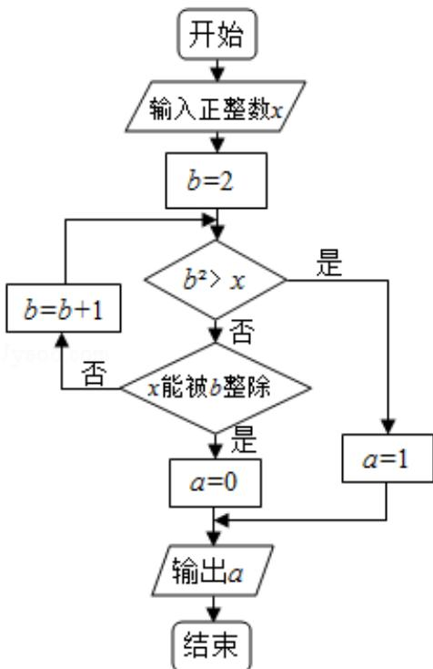

<!-- question-source:start -->
6. (5 分) 执行两次如图所示的程序框图, 若第一次输入的 $x$ 值为 7 , 第二次输入的 $x$ 值为 9 , 则第一次, 第二次输出的 $a$ 值分别为 ( )

A. 0, 0 B. 1, 1 C. 0, 1 D. 1, 0
<!-- question-source:end -->

![[高中/真题/按年份分类/2017/2017年山东省高考数学试卷_理科_word版试卷及解析/选择题/题目/answers/Q00025760A1.md]]
