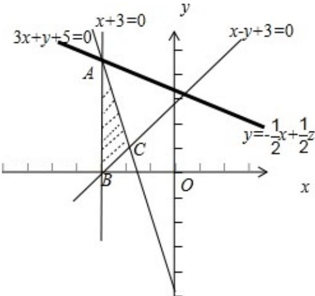

> [!faq]- 2017年山东省高考数学试卷(理科)word版试卷及解析解析
>
> > [!success]- **【答案】** C
>
> > [!note]- **【分析】**
> > 本题未单列分析。
>
> > [!note]- **【解析】**
> > 解答】解：画出约束条件 $\left\{ \begin{array}{l} x - y + 3 \leqslant 0 \\ 3x + y + 5 \leqslant 0 \\ x + 3 \geqslant 0 \end{array} \right.$ 表示的平面区域，如图所示；
> >
> > 
> >
> > 由 $\left\{\begin{aligned}x+3&=0\\ 3x+y&+5&=0\end{aligned}\right.$ 解得A（-3，4），
> >
> > 此时直线 $y = -\frac{1}{2} x + \frac{1}{2} z$ 在 $y$ 轴上的截距最大，
> >
> > 所以目标函数 $z=x+2y$ 的最大值为
> >
> > $$
> > z _ {\max} = - 3 + 2 \times 4 = 5.
> > $$
> >
> > 故选：C.
