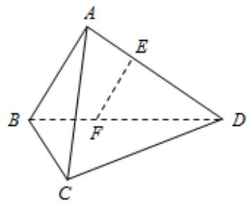
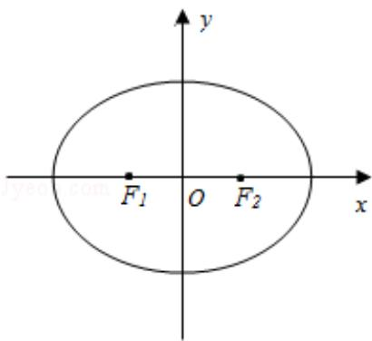
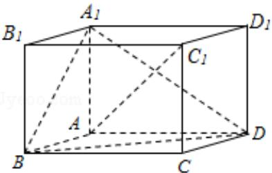

# 2017 年江苏省高考数学试卷

##
一.填空题

1. (5 分) 已知集合 $A = \{1, 2\}$ , $B = \{a, a^2 + 3\}$ . 若 $A \cap B = \{1\}$ , 则实数 $a$ 的值为 \_\_\_\_.

2. （5分）已知复数 $z = (1 + i)$ （ $1 + 2i$ ），其中 $i$ 是虚数单位，则 $z$ 的模是 \_\_\_\_.

3. （5分）某工厂生产甲、乙、丙、丁四种不同型号的产品，产量分别为

200, 400, 300, 100 件. 为检验产品的质量, 现用分层抽样的方法从以上所有的产

品中抽取 60 件进行检验，则应从丙种型号的产品中抽取\_\_\_\_件。

4. (5 分) 如图是一个算法流程图: 若输入 $x$ 的值为 $\frac{1}{16}$ , 则输出 $y$ 的值是 \_\_\_\_.

5. (5分) 若 $\tan (\alpha - \frac{\pi}{4}) = \frac{1}{6}$ . 则 $\tan \alpha =$ \_\_\_\_.

6. (5 分) 如图, 在圆柱 $\mathrm{O}_{1} \mathrm{O}_{2}$ 内有一个球 $\mathrm{O}$ , 该球与圆柱的上、下底面及母线均相

切，记圆柱 $O_{1}O_{2}$ 的体积为 $V_{1}$ ，球 O 的体积为 $V_{2}$ ，则 $\frac{V_{1}}{V_{2}}$ 的值是 \_\_\_\_.

7. (5 分) 记函数 $f(x) = \sqrt{6 + x - x^2}$ 定义域为 D. 在区间 $[-4, 5]$ 上随机取一个数 $x$ , 则 $x \in D$ 的概率是 \_\_\_\_.

8. (5分) 在平面直角坐标系 xOy 中, 双曲线 $\frac{x^{2}}{3} - y^{2} = 1$ 的右准线与它的两条渐近线分别交于点 P, Q, 其焦点是 $F_{1}, F_{2}$ , 则四边形 $F_{1}PF_{2}Q$ 的面积是 \_\_\_\_.

9. (5 分) 等比数列 $\{a_{n}\}$ 的各项均为实数, 其前 $n$ 项为 $S_{n}$ , 已知 $S_{3} = \frac{7}{4}, S_{6} = \frac{63}{4}$ , 则 $a_{8} =$

10. (5 分) 某公司一年购买某种货物 600 吨, 每次购买 x 吨, 运费为 6 万元/次, 一
年的总存储费用为 4x 万元. 要使一年的总运费与总存储费用之和最小, 则 x 的值
是\_\_\_\_.

11. (5 分) 已知函数 $f(x) = x^3 - 2x + e^x - \frac{1}{e^x}$ ，其中 $e$ 是自然对数的底数。若 $f(a - 1) + f(2a^2) \leqslant 0$ 。则实数 $a$ 的取值范围是 \_\_\_\_。

12. (5 分) 如图, 在同一个平面内, 向量 $\overrightarrow{OA}$ , $\overrightarrow{OB}$ , $\overrightarrow{OC}$ 的模分别为 1, 1, $\sqrt{2}$ , $\overrightarrow{OA}$ 与 $\overrightarrow{OC}$ 的夹角为 $\alpha$ , 且 $\tan \alpha = 7$ , $\overrightarrow{OB}$ 与 $\overrightarrow{OC}$ 的夹角为 $45^{\circ}$ . 若 $\overrightarrow{OC} = m\overrightarrow{OA} + n\overrightarrow{OB}$ ( $m, n \in R$ ), 则 $m + n =$ \_\_\_\_.

13. (5 分) 在平面直角坐标系 xOy 中, A(-12,0), B(0,6), 点 P 在圆 O: $x^{2}+y^{2}=50$ 上．若 $\overrightarrow{PA} \cdot \overrightarrow{PB} \leqslant 20$ ，则点 P 的横坐标的取值范围是 \_\_\_\_．

14. $$
f (x) =
$$

$\left\{ \begin{array}{l} x^{2}, x \in D \\ x, x \notin D \end{array} \right.$ ，其中集合 $D = \{x \mid x = \frac{n - 1}{n}, n \in N^{*}\}$ ，则方程 $f(x) - \lg x = 0$ 的解的个数是

##
二.解答题

15. (14 分) 如图, 在三棱锥 A - BCD 中, AB⊥AD, BC⊥BD, 平面 ABD⊥平面 BCD, 点
E、F（E 与 A、D 不重合）分别在棱 AD，BD 上，且 EF⊥AD.

求证：（1）EF∥平面ABC；

(2) AD⊥AC.

16. （14分）已知向量 $\vec{a} = (\cos x, \sin x)$ ， $\vec{b} = (3, -\sqrt{3})$ ， $x \in [0, \pi]$ .

(1) 若 $\vec{a} \parallel \vec{b}$ ，求 x 的值；

(2) 记 $f(x) = \vec{a} \cdot \vec{b}$ ，求 $f(x)$ 的最大值和最小值以及对应的 $x$ 的值.

17. (14 分) 如图, 在平面直角坐标系 xOy 中, 椭圆 E: $\frac{x^{2}}{a^{2}} + \frac{y^{2}}{b^{2}} = 1 (a > b > 0)$ 的左、右焦点分别为 $F_{1}, F_{2}$ , 离心率为 $\frac{1}{2}$ , 两准线之间的距离为 8. 点 P 在椭圆 E 上, 且位于第一象限, 过点 $F_{1}$ 作直线 $PF_{1}$ 的垂线 $I_{1}$ , 过点 $F_{2}$ 作直线 $PF_{2}$ 的垂线 $I_{2}$ .

(1) 求椭圆 E 的标准方程;

(2) 若直线 $I_{1}$ , $I_{2}$ 的交点 $Q$ 在椭圆 $E$ 上, 求点 $P$ 的坐标.

18.（16分）如图，水平放置的正四棱柱形玻璃容器Ⅰ和正四棱台形玻璃容器Ⅱ的

高均为 $32\mathrm{cm}$ ，容器I的底面对角线AC的长为 $10\sqrt{7}\mathrm{cm}$ ，容器II的两底面对角线

EG， $E_{1}G_{1}$ 的长分别为 14cm 和 62cm．分别在容器 I 和容器 II 中注入水，水深均为

12cm. 现有一根玻璃棒 I, 其长度为 40cm. (容器厚度、玻璃棒粗细均忽略不计)

(1) 将 I 放在容器 I 中, I 的一端置于点 A 处, 另一端置于侧棱 $CC_{1}$ 上, 求 I 没入水

中部分的长度；

(2) 将 I 放在容器 II 中, I 的一端置于点 E 处, 另一端置于侧棱 $GG_{1}$ 上, 求 I 没入水

中部分的长度.

  
容器 I

  
容器II

19. (16 分) 对于给定的正整数 k，若数列 $\{a_{n}\}$ 满足： $a_{n-k} + a_{n-k+1} + \ldots + a_{n-1} + a_{n+1} + \ldots + a_{n+k}$

$_{-1}+a_{n+k}=2ka_{n}$ 对任意正整数 n (n>k) 总成立，则称数列 $\{a_{n}\}$ 是 “P(k) 数列”.

(1) 证明: 等差数列 $\{a_{n}\}$ 是 “P
(3) 数列”;

(2) 若数列 $\{a_{n}\}$ 既是“P
(2)数列”，又是“P
(3)数列”，证明： $\{a_{n}\}$ 是等差数列.

20. (16 分) 已知函数 $f(x) = x^3 + ax^2 + bx + 1 (a > 0, b \in \mathbb{R})$ 有极值，且导函数 $f'(x)$ 的极

值点是 $f(x)$ 的零点。（极值点是指函数取极值时对应的自变量的值）

(1) 求 b 关于 a 的函数关系式，并写出定义域；

(2) 证明: $b^{2} > 3a$ ;

(3) 若 $f(x), f'(x)$ 这两个函数的所有极值之和不小于 $-\frac{7}{2}$ ，求 $a$ 的取值范围.

##
二.非选择题，附加题（21-24选做题）【选修4-1：几何证明选讲】（本小题满分0

分)

21. 如图，AB 为半圆 O 的直径，直线 PC 切半圆 O 于点 C，AP⊥PC，P 为垂足.

求证：
（1） $\angle PAC = \angle CAB$ ；

(2) $AC^{2}=AP\bullet AB$ .

[选修 4-2：矩阵与变换]

22. 已知矩阵 $A = \begin{bmatrix} 0 & 1 \\ 1 & 0 \end{bmatrix}$ , $B = \begin{bmatrix} 1 & 0 \\ 0 & 2 \end{bmatrix}$ .

(1) 求 AB;

(2) 若曲线 $C_1: \frac{x^2}{8} + \frac{y^2}{2} = 1$ 在矩阵AB对应的变换作用下得到另一曲线 $C_2$ , 求 $C_2$ 的

方程.

## [选修 4-4：坐标系与参数方程]

23. 在平面直角坐标系 xOy 中, 已知直线 I 的参数方程为 $\left\{ \begin{array}{l} x = -8 + t \\ y = \frac{t}{2} \end{array} \right.$ (t 为参数), 曲线 C 的参数方程为 $\left\{ \begin{array}{l} x = 2s^2 \\ y = 2\sqrt{2}s \end{array} \right.$ (s 为参数). 设 P 为曲线 C 上的动点, 求点 P 到直线 I 的距离的最小值.

[选修 4-5：不等式选讲]

24. 已知 a, b, c, d 为实数，且 $a^{2}+b^{2}=4$ , $c^{2}+d^{2}=16$ ，证明 $ac+bd \leq 8$ .

【必做题】

25. 如图, 在平行六面体 $ABCD - A_1B_1C_1D_1$ 中, $AA_1 \perp$ 平面 $ABCD$ , 且 $AB = AD = 2$ , $AA_1 = \sqrt{3}$ , $\angle BAD = 120^\circ$ .

(1) 求异面直线 $A_{1}B$ 与 $AC_{1}$ 所成角的余弦值；

(2) 求二面角 $B - A_{1}D - A$ 的正弦值.

26. 已知一个口袋有 m 个白球, n 个黑球 (m, n∈N\*, n≥2), 这些球除颜色外全部相同。现将口袋中的球随机的逐个取出, 并放入如图所示的编号为 1, 2, 3, …, m+n 的抽屉内, 其中第 k 次取出的球放入编号为 k 的抽屉 (k=1, 2, 3, …, m+n)。

<table><tr><td>1</td><td>2</td><td>3</td><td>...</td><td>m+n</td></tr></table>

(1) 试求编号为 2 的抽屉内放的是黑球的概率 p;

(2) 随机变量 $x$ 表示最后一个取出的黑球所在抽屉编号的倒数, $\mathrm{E}(\mathrm{X})$ 是 $\mathrm{X}$ 的数学期望, 证明 $\mathrm{E}(\mathrm{X}) < \frac{\mathrm{n}}{(\mathrm{m} + \mathrm{n})(\mathrm{n} - 1)}$ .

# 2017 年江苏省高考数学试卷

参考
答案与
试题
解析

##

![[高中/真题/按年份分类/2017/2017年江苏高考数学试题及答案/填空题/填空题.md]]
![[高中/真题/按年份分类/2017/2017年江苏高考数学试题及答案/解答题/解答题.md]]
![[高中/真题/按年份分类/2017/2017年江苏高考数学试题及答案/选择题/选择题.md]]
