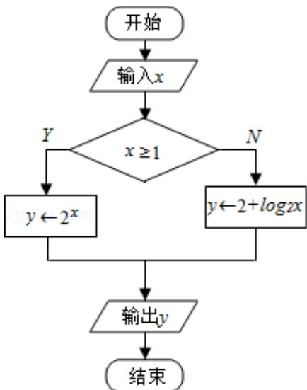

<!-- question-source:start -->
4. (5 分) 如图是一个算法流程图: 若输入 $x$ 的值为 $\frac{1}{16}$ , 则输出 $y$ 的值是 \_\_\_\_.

<!-- question-source:end -->

![[高中/真题/按年份分类/2017/2017年江苏高考数学试题及答案/填空题/题目/answers/Q00026816A1.md]]
