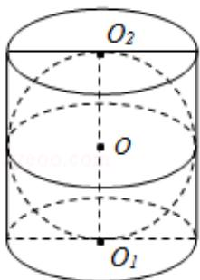

<!-- question-source:start -->
6. (5 分) 如图, 在圆柱 $\mathrm{O}_{1} \mathrm{O}_{2}$ 内有一个球 $\mathrm{O}$ , 该球与圆柱的上、下底面及母线均相

切，记圆柱 $O_{1}O_{2}$ 的体积为 $V_{1}$ ，球 O 的体积为 $V_{2}$ ，则 $\frac{V_{1}}{V_{2}}$ 的值是 \_\_\_\_.

<!-- question-source:end -->

![[高中/真题/按年份分类/2017/2017年江苏高考数学试题及答案/填空题/题目/answers/Q00026818A1.md]]
