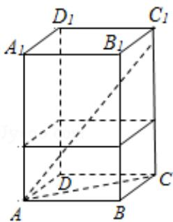
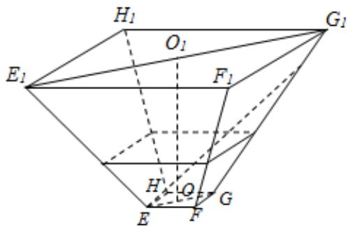

<!-- question-source:start -->
18.（16分）如图，水平放置的正四棱柱形玻璃容器Ⅰ和正四棱台形玻璃容器Ⅱ的

高均为 $32\mathrm{cm}$ ，容器I的底面对角线AC的长为 $10\sqrt{7}\mathrm{cm}$ ，容器II的两底面对角线

EG， $E_{1}G_{1}$ 的长分别为 14cm 和 62cm．分别在容器 I 和容器 II 中注入水，水深均为

12cm. 现有一根玻璃棒 I, 其长度为 40cm. (容器厚度、玻璃棒粗细均忽略不计)

(1) 将 I 放在容器 I 中, I 的一端置于点 A 处, 另一端置于侧棱 $CC_{1}$ 上, 求 I 没入水

中部分的长度；

(2) 将 I 放在容器 II 中, I 的一端置于点 E 处, 另一端置于侧棱 $GG_{1}$ 上, 求 I 没入水

中部分的长度.

  
容器 I

  
容器II
<!-- question-source:end -->

![[高中/真题/按年份分类/2017/2017年江苏高考数学试题及答案/填空题/题目/answers/Q00026829A1.md]]
