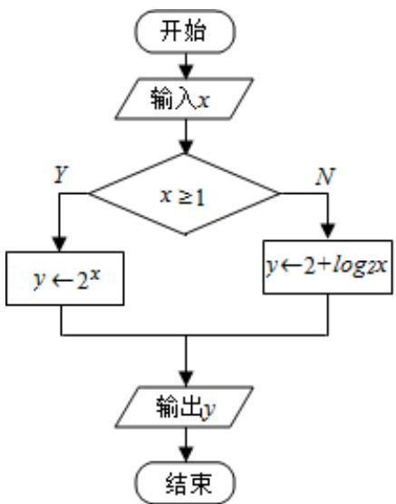

<!-- question-source:start -->
4. (5 分) (2017•江苏) 如图是一个算法流程图: 若输入 x 的值为 $\frac{1}{16}$ , 则输出 y 的值是 -2 .

【
<!-- question-source:end -->

![[高中/真题/按年份分类/2017/2017年江苏高考数学试题及答案/填空题/题目/answers/Q00028675A1.md]]
