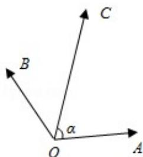

<!-- question-source:start -->
12. (5 分) (2017•江苏) 如图, 在同一个平面内, 向量 $\overrightarrow{OA}$ , $\overrightarrow{OB}$ , $\overrightarrow{OC}$ 的模分别为 1, 1, $\sqrt{2}$ , $\overrightarrow{OA}$ 与 $\overrightarrow{OC}$ 的夹角为 $\alpha$ , 且 $\tan\alpha=7$ , $\overrightarrow{OB}$ 与 $\overrightarrow{OC}$ 的夹角为 $45^{\circ}$ . 若 $\overrightarrow{OC}=m\overrightarrow{OA}+n\overrightarrow{OB}$ (m, n∈R), 则 m+n=3 \_\_\_\_.

【
<!-- question-source:end -->

![[高中/真题/按年份分类/2017/2017年江苏高考数学试题及答案/填空题/题目/answers/Q00028683A1.md]]
