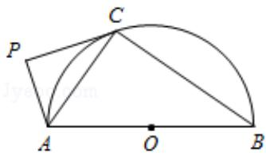

<!-- question-source:start -->
21. 如图，AB 为半圆 O 的直径，直线 PC 切半圆 O 于点 C，AP⊥PC，P 为垂足.

求证：
（1） $\angle PAC = \angle CAB$ ；

(2) $AC^{2}=AP\bullet AB$ .

[选修 4-2：矩阵与变换]
<!-- question-source:end -->

![[高中/真题/按年份分类/2017/2017年江苏高考数学试题及答案/填空题/题目/answers/Q00029485A1.md]]
