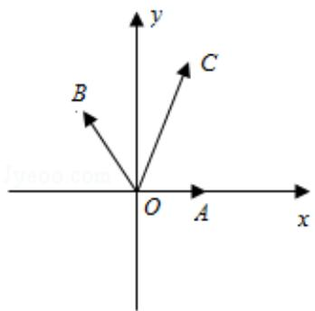

> [!faq]- 2017年江苏高考数学试题及答案解析
>
> > [!success]- **【答案】** 为：3.  【点评】本题考查了向量坐标运算性质、和差公式，考查了推理能力与计算能力， 属于中档题.
>
> > [!note]- **【分析】**
> > 如图所示, 建立直角坐标系. A(1,0). 由 $\overrightarrow{OA}$ 与 $\overrightarrow{OC}$ 的夹角为 $\alpha$ , 且 $\tan \alpha = 7$ . 可得 $\cos \alpha = \frac{1}{5\sqrt{2}}$ , $\sin \alpha = \frac{7}{5\sqrt{2}}$ . C $(\frac{1}{5}, \frac{7}{5})$ . 可得 $\cos (\alpha + 45^\circ) = -\frac{3}{5}$ . $\sin (\alpha + 45^\circ) = \frac{4}{5}$ . B $(\frac{3}{5}, \frac{4}{5})$ . 利用 $\overrightarrow{OC} = m\overrightarrow{OA} + n\overrightarrow{OB}$ (m, n ∈ R), 即可得出.
>
> > [!note]- **【解析】**
> > 分析】如图所示, 建立直角坐标系. A(1,0). 由 $\overrightarrow{OA}$ 与 $\overrightarrow{OC}$ 的夹角为 $\alpha$ , 且 $\tan \alpha = 7$ . 可得 $\cos \alpha = \frac{1}{5\sqrt{2}}$ , $\sin \alpha = \frac{7}{5\sqrt{2}}$ . C $(\frac{1}{5}, \frac{7}{5})$ . 可得 $\cos (\alpha + 45^\circ) = -\frac{3}{5}$ . $\sin (\alpha + 45^\circ) = \frac{4}{5}$ . B $(\frac{3}{5}, \frac{4}{5})$ . 利用 $\overrightarrow{OC} = m\overrightarrow{OA} + n\overrightarrow{OB}$ (m, n ∈ R), 即可得出.
> >
> > 【
> > 解答】解：如图所示，建立直角坐标系．A（1，0）.
> >
> > 由 $\overrightarrow{OA}$ 与 $\overrightarrow{OC}$ 的夹角为 $\alpha$ ，且 $\tan\alpha=7$ .
> >
> > $$
> > \therefore \cos \alpha = \frac {1}{5 \sqrt {2}}, \sin \alpha = \frac {7}{5 \sqrt {2}}.
> > $$
> >
> > $\therefore C\left(\frac{1}{5},\frac{7}{5}\right).$
> >
> > $$
> > \cos (a + 4 5 ^ {\circ}) = \frac {\sqrt {2}}{2} (\cos a - \sin a) = - \frac {3}{5}.
> > $$
> >
> > $\sin (\alpha + 45^{\circ}) = \frac{\sqrt{2}}{2} (\sin \alpha + \cos \alpha) = \frac{4}{5}$ .
> >
> > $$
> > \therefore B \left(\frac {3}{5}, \frac {4}{5}\right).
> > $$
> >
> > $$
> > \because \overrightarrow {O C} = m \overrightarrow {O A} + n \overrightarrow {O B} (m, n \in R),
> > $$
> >
> > $$
> > \therefore \frac {1}{5} = m - \frac {3}{5} n, \frac {7}{5} = 0 + \frac {4}{5} n,
> > $$
> >
> > 解得 $n=\frac{7}{4}$ ， $m=\frac{5}{4}$ .
> >
> > 则 $m+n=3$ .
> >
> > 故
> > 答案为：3.
> >
> > 
> >
> > 【点评】本题考查了向量坐标运算性质、和差公式，考查了推理能力与计算能力，
> >
> > 属于中档题.
