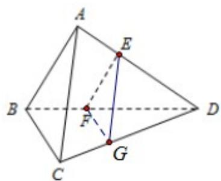

> [!faq]- 2017年江苏高考数学试题及答案解析
>
> > [!success]- **【答案】** （14 分）（2017•江苏）如图，在三棱锥 A-BCD 中，AB⊥AD，BC⊥BD，平面
>
> > [!note]- **【分析】**
> > （1）利用 AB∥EF 及线面平行判定定理可得结论；
> > (2) 通过取线段 CD 上点 G，连结 FG、EG 使得 FG∥BC，则 EG∥AC，利用线面垂直的
>
> > [!note]- **【解析】**
> > 证明：
> > （1）因为 AB⊥AD，EF⊥AD，且 A、B、E、F 四点共面，
> >
> > 所以 AB∥EF，
> >
> > 又因为 EF ⊆ 平面 ABC，AB ⊆ 平面 ABC，
> >
> > 所以由线面平行判定定理可知：EF∥平面 ABC；
> > (2) 在线段 CD 上取点 G，连结 FG、EG 使得 FG∥BC，则 EG∥AC，
> >
> > 因为 BC⊥BD，所以 FG∥BC，
> >
> > 又因为平面 ABD⊥平面 BCD，
> >
> > 所以 FG⊥平面 ABD，所以 FG⊥AD，
> >
> > 又因为 AD⊥EF，且 EF∩FG=F，
> >
> > 所以 AD⊥平面 EFG，所以 AD⊥EG，
> >
> > 故 AD⊥AC.
> >
> > 
