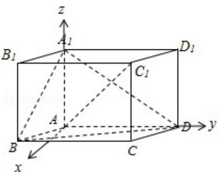

> [!faq]- 2017年江苏高考数学试题及答案解析
>
> > [!success]- **【答案】** (2017·江苏) 如图, 在平行六面体 $ABCD - A_1B_1C_1D_1$ 中, $AA_1 \perp$ 平面 $ABCD$ , 且 $AB = AD =
>
> > [!note]- **【分析】**
> > 在平面 ABCD 内，过 A 作 Ax⊥AD，由 AA₁⊥平面 ABCD，可得
>
> > [!note]- **【解析】**
> > 解：在平面 ABCD 内，过 A 作 Ax⊥AD，
> >
> > ∵AA $_{1}$ ⊥平面ABCD，AD、Ax⊂平面ABCD，
> >
> > $$
> > \therefore \mathrm{AA} _ {1} \perp \mathrm{Ax}, \quad \mathrm{AA} _ {1} \perp \mathrm{AD},
> > $$
> >
> > 以 A 为坐标原点，分别以 Ax、AD、 $AA_{1}$ 所在直线为 x、y、z 轴建立空间直角坐标系.
> >
> > $$
> > \because A B = A D = 2, \quad A A _ {1} = \sqrt {3}, \quad \angle B A D = 1 2 0 ^ {\circ},
> > $$
> >
> > $\therefore A(0, 0, 0), B(\sqrt{3}, -1, 0), C(\sqrt{3}, 1, 0)$
> >
> > D $(0, 2, 0)$ ,
> >
> > $A_{1}$ (0, 0, $\sqrt{3}$ ), $C_{1}$ ( $\sqrt{3}$ , 1, $\sqrt{3}$ ).
> >
> > $$
> > \overrightarrow {\mathrm{A} _ {1} \mathrm{B}} = (\sqrt {3}, - 1, - \sqrt {3}), \quad \overrightarrow {\mathrm{AC} _ {1}} = (\sqrt {3}, 1, \sqrt {3}), \quad \overrightarrow {\mathrm{DB}} = (\sqrt {3}, - 3, 0),
> > $$
> >
> > $$
> > \overrightarrow {\mathrm{DA} _ {1}} = (0, - 2, \sqrt {3}).
> > $$
> >
> > $$
> > \because \cos <   \overrightarrow {A _ {1} B}, \overrightarrow {A C _ {1}} > = \frac {\overrightarrow {A _ {1} B} \cdot \overrightarrow {A C _ {1}}}{| \overrightarrow {A _ {1} B} | | \overrightarrow {A C _ {1}} |} = \frac {- 1}{\sqrt {7} \times \sqrt {7}} = - \frac {1}{7}. \tag {1}
> > $$
> >
> > ∴异面直线 $A_{1}B$ 与 $AC_{1}$ 所成角的余弦值为 $\frac{1}{7}$ ;
> > (2) 设平面 $BA_{1}D$ 的一个法向量为 $\vec{n}=(x,y,z)$ ,
> >
> > 由 $\left\{ \begin{array}{l} \overrightarrow{\mathrm{n}} \cdot \overrightarrow{\mathrm{DB}} = 0 \\ \overrightarrow{\mathrm{n}} \cdot \overrightarrow{\mathrm{DA}_1} = 0 \end{array} \right.$ ，得 $\left\{ \begin{array}{l} \sqrt{3}\mathrm{x} - 3\mathrm{y} = 0 \\ -2\mathrm{y} + \sqrt{3}\mathrm{z} = 0 \end{array} \right.$ ，取 $x = \sqrt{3}$ ，得 $\overrightarrow{\mathrm{n}} = (\sqrt{3}, 1, \frac{2\sqrt{3}}{3})$ ；
> >
> > 取平面 $A_{1}AD$ 的一个法向量为 $\vec{\pi}=(1,0,0)$ .
> >
> > $$
> > \therefore \cos <   \overrightarrow {m}, \quad \overrightarrow {n} > = \frac {\overrightarrow {m} \cdot \overrightarrow {n}}{| \overrightarrow {m} | | \overrightarrow {n} |} = \frac {\sqrt {3}}{1 \times \sqrt {3 + 1 + \frac {4}{3}}} = \frac {3}{4}.
> > $$
> >
> > ∴二面角 $B-A_{1}D-A$ 的正弦值为 $\frac{3}{4}$ ，则二面角 $B-A_{1}D-A$ 的正弦值为 $\sqrt{1-\left(\frac{3}{4}\right)^{2}}=\frac{\sqrt{7}}{4}$ .
> >
> > 
