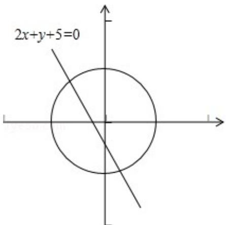

> [!faq]- 2017年江苏高考数学试题及答案解析
>
> > [!success]- **【答案】** . 【
>
> > [!note]- **【分析】**
> > 根据题意，设 $P(x_0, y_0)$ ，由数量积的坐标计算公式化简变形可得
>
> > [!note]- **【解析】**
> > 分析】根据题意，设 $P(x_0, y_0)$ ，由数量积的坐标计算公式化简变形可得
> >
> > $2x_{0} + y_{0} + 5 \leq 0$ ，
> > 分析可得其表示表示直线 $2x + y + 5 \leq 0$ 以及直线下方的区域，联立直
> >
> > 线与圆的方程可得交点的横坐标，结合图形
> > 分析可得
> > 答案.
> >
> > 【
> > 解答】解：根据题意，设 $P(x_{0}, y_{0})$ ，则有 $x_{0}^{2} + y_{0}^{2} = 50$ ，
> >
> > $$
> > \overrightarrow {\mathrm{PA}} \cdot \overrightarrow {\mathrm{PB}} = (- 1 2 - x _ {0}, - y _ {0}) \cdot (- x _ {0}, 6 - y _ {0}) = (1 2 + x _ {0}) x _ {0} - y _ {0} (6 -
> > $$
> >
> > $$
> > \left. \mathrm{y} _ {0}\right) = 1 2 \mathrm{x} _ {0} + 6 \mathrm{y} + \mathrm{x} _ {0} ^ {2} + \mathrm{y} _ {0} ^ {2} \leq 2 0,
> > $$
> >
> > 化为： $12x_{0}-6y_{0}+30\leq0$
> >
> > 即 $2x_{0}-y_{0}+5\leq0$ ，表示直线 $2x+y+5\leq0$ 以及直线下方的区域，
> >
> > 联立 $\left\{\begin{aligned}x_{0}^{2}+y_{0}^{2}&=50\\ 2x_{0}-y_{0}+5&=0\end{aligned}\right.$ ，解可得 $x_{0}=-5$ 或 $x_{0}=1$ ，
> >
> > 结合图形
> > 分析可得：点 P 的横坐标 $x_{0}$ 的取值范围是 $[-5\sqrt{2}, 1]$ ,
> >
> > 故
> > 答案为： $[-5\sqrt{2}, 1]$ .
> >
> > 
> >
> > 【点评】本题考查数量积的运算以及直线与圆的位置关系，关键是利用数量积化简变形得到关于 $x_0$ 、 $y_0$ 的关系式.
