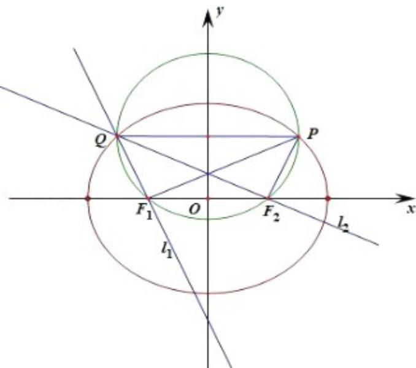

> [!faq]- 2017年江苏高考数学试题及答案解析
>
> > [!success]- **【答案】** (14 分)
>
> > [!note]- **【分析】**
> > （1）由椭圆的离心率公式求得 $a = 2c$ ，由椭圆的准线方程 $x = \pm \frac{2a^2}{c}$ ，则 $2 \times \frac{2a^2}{c} = 8$ ，即可求得 $a$ 和 $c$ 的值，则 $b^2 = a^2 - c^2 = 3$ ，即可求得椭圆方程；
> > (2) 设 P 点坐标, 分别求得直线 $PF_{2}$ 的斜率及直线 $PF_{1}$ 的斜率, 则即可求得 $I_{2}$ 及 $I_{1}$ 的斜率及方程, 联立求得 Q 点坐标, 由 Q 在椭圆方程, 求得 $y_{0}^{2}=x_{0}^{2}-1$ , 联立即可求
>
> > [!note]- **【解析】**
> > 解：
> > （1）由题意可知：椭圆的离心率 $e=\frac{c}{a}=\frac{1}{2}$ ，则 a=2c，①
> >
> > $$
> > x = \pm \frac {a ^ {2}}{c}
> > $$
> >
> > $$
> > 2 \times \frac {a ^ {2}}{c} = 8
> > $$
> >
> > 由①②解得：a=2，c=1，
> >
> > 则 $b^{2}=a^{2}-c^{2}=3$ ，
> >
> > ∴椭圆的标准方程： $\frac{x^{2}}{4}+\frac{y^{2}}{3}=1;$
> > (2) 方法一：设 $P(x_0, y_0)$ ，则直线 $PF_2$ 的斜率 $k_{PF_2} = \frac{y_0}{x_0 - 1}$ ，则直线 $l_2$ 的斜率 $k_2 = -\frac{x_0 - 1}{y_0}$ ，直线 $l_2$ 的方程 $y = -\frac{x_0 - 1}{y_0}(x - 1)$ ，直线 $PF_1$ 的斜率 $k_{PF_1} = \frac{y_0}{x_0 + 1}$ ，则直线 $l_2$ 的斜率 $k_2 = -\frac{x_0 + 1}{y_0}$ ，直线 $l_2$ 的方程 $y = -\frac{x_0 + 1}{y_0}(x + 1)$ ，联立 $\left\{ \begin{array}{l} y = \frac{x_0 - 1}{y_0}(x - 1) \\ y = \frac{x_0 + 1}{y_0}(x + 1) \end{array} \right.$ ，解得： $\left\{ \begin{array}{l} x = -x_0 \\ y = \frac{x_0^2 - 1}{y_0} \end{array} \right.$ ，则 $Q(-x_0, \frac{x_0^2 - 1}{y_0})$
> >
> > 由 P, Q 在椭圆上, P, Q 的横坐标互为相反数, 纵坐标应相等, 则 $y_{0}=\frac{x_{0}^{2}-1}{y_{0}}$ ,
> >
> > $$
> > \therefore \mathbf {y} _ {0} ^ {2} = \mathbf {x} _ {0} ^ {2} - 1
> > $$
> >
> > 则 $\left\{ \begin{array}{l} \frac{x_0^2}{4} + \frac{y_0^2}{3} = 1 \\ y_0^2 = x_0^2 - 1 \end{array} \right.$ ，解得： $\left\{ \begin{array}{l} x_0^2 = \frac{16}{7} \\ y_0^2 = \frac{9}{7} \end{array} \right.$ ，则 $\left\{ \begin{array}{l} x_0 = \pm \frac{4\sqrt{7}}{7} \\ y_0 = \pm \frac{3\sqrt{7}}{7} \end{array} \right.$ ，
> >
> > 又 P 在第一象限，所以 P 的坐标为：
> >
> > P $\left(\frac{4\sqrt{7}}{7}, \frac{3\sqrt{7}}{7}\right)$
> >
> > 
> >
> > 方法二：设 P（m，n），由 P 在第一象限，则 m > 0，n > 0，
> >
> > 当 $m = 1$ 时， $\mathrm{k}_{\mathrm{PF}_2}$ 不存在，解得：Q与 $\mathsf{F}_1$ 重合，不满足题意，
> >
> > 当 $m = 1$ 时， $\mathrm{k}_{\mathrm{PF}_2} = \frac{\mathrm{n}}{\mathrm{m} - 1},\mathrm{k}_{\mathrm{PF}_1} = \frac{\mathrm{n}}{\mathrm{m} + 1},$
> >
> > 由 $I_1 \perp PF_1, I_2 \perp PF_2$ ，则 $k_{1_1} = -\frac{m+1}{n}, k_{1_2} = -\frac{m-1}{n}$ ，
> >
> > 直线 $l_{1}$ 的方程 $y = -\frac{m + 1}{n} (x + 1)$ ，①直线 $l_{2}$ 的方程 $y = -\frac{m - 1}{n} (x - 1)$ ，②
> >
> > 联立解得： $x = -m$ ，则 $Q(-m, \frac{m^2 - 1}{n})$ ，
> >
> > 由Q在椭圆方程，由对称性可得： $\frac{\mathrm{m}^2 - 1}{\mathrm{n}} = \pm \mathrm{n}^2$
> >
> > 即 $m^{2}-n^{2}=1$ ，或 $m^{2}+n^{2}=1$ ，
> >
> > 由 $P(m, n)$ ，在椭圆方程， $\left\{ \begin{array}{l} m^2 - 1 = n^2 \\ \frac{m^2}{4} + \frac{n^2}{3} = 1 \end{array} \right.$ ，解得： $\left\{ \begin{array}{l} m^2 = \frac{16}{7} \\ n^2 = \frac{9}{7} \end{array} \right.$ ，或 $\left\{ \begin{array}{l} 1 - m^2 = n^2 \\ \frac{m^2}{4} + \frac{n^2}{3} = 1 \end{array} \right.$ ，无解，
> >
> > 又 P 在第一象限，所以 P 的坐标为：
> >
> > P $\left(\frac{4\sqrt{7}}{7},\frac{3\sqrt{7}}{7}\right)$
