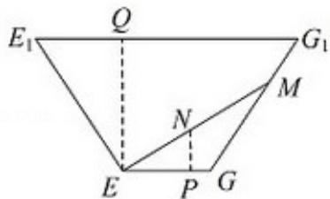
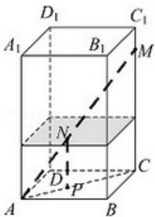

> [!faq]- 2017年江苏高考数学试题及答案解析
>
> > [!success]- **【答案】** 详见解析
>
> > [!note]- **【分析】**
> > （1）设玻璃棒在 $CC_{1}$ 上的点为 M，玻璃棒与水面的交点为 N，过 N 作
>
> > [!note]- **【解析】**
> > 解：
> > （1）设玻璃棒在 $CC_{1}$ 上的点为 M，玻璃棒与水面的交点为 N，
> >
> > 在平面 ACM 中，过 N 作 NP||MC，交 AC 于点 P，
> >
> > ∵ABCD - A₁B₁C₁D₁为正四棱柱，∴CC₁⊥平面ABCD，
> >
> > 又∵ACC平面ABCD，∴CC $_{1}$ ⊥AC，∴NP⊥AC，
> >
> > ∴NP=12cm，且 $AM^{2}=AC^{2}+MC^{2}$ ，解得 MC=30cm，
> >
> > ∵NP∥MC, ∴△ANP∼△AMC,
> >
> > $\therefore \frac{AN}{AM} = \frac{NP}{MC}, \frac{AN}{40} = \frac{12}{30}$ ，得 $AN = 16cm$ 。
> >
> > ∴玻璃棒Ⅰ没入水中部分的长度为16cm.
> > (2) 设玻璃棒在 $GG_{1}$ 上的点为 M，玻璃棒与水面的交点为 N，
> >
> > 在平面 $E_{1}EGG_{1}$ 中，过点 N 作 NP⊥EG，交 EG 于点 P，
> >
> > 过点 E 作 $EQ \perp E_{1}G_{1}$ ，交 $E_{1}G_{1}$ 于点 Q，
> >
> > ∵EFGH - $E_{1}F_{1}G_{1}H_{1}$ 为正四棱台，∴ $EE_{1}=GG_{1}$ ， $EG\|E_{1}G_{1}$
> >
> > $EG=E_{1}G_{1},$
> >
> > $\therefore \mathrm{EE}_{1} \mathrm{G}_{1} \mathrm{G}$ 为等腰梯形，画出平面 $\mathrm{E}_{1} \mathrm{EGG}_{1}$ 的平面图，
> >
> > $\because E_{1}G_{1}=62cm,\quad EG=14cm,\quad EQ=32cm,\quad NP=12cm,$
> >
> > $\therefore E_{1}Q=24cm,$
> >
> > 由勾股定理得： $E_{1}E=40cm$ ，
> >
> > $$
> > \therefore \sin \angle E E _ {1} G _ {1} = \frac {4}{5}, \sin \angle E G M = \sin \angle E E _ {1} G _ {1} = \frac {4}{5}, \cos \angle E G M = - \frac {3}{5},
> > $$
> >
> > 根据正弦定理得： $\frac{\mathrm{EM}}{\sin\angle\mathrm{EGM}} = \frac{\mathrm{EG}}{\sin\angle\mathrm{EMG}},\therefore \sin \angle \mathrm{EMG} = \frac{7}{25},\cos \angle \mathrm{EMG} = \frac{24}{25},$
> >
> > $$
> > \therefore \sin \angle G E M = \sin (\angle E G M + \angle E M G) = \sin \angle E G M \cos \angle E M G + \cos \angle E G M \sin \angle E M G = \frac {3}{5},
> > $$
> >
> > $$
> > \therefore \mathrm{EN} = \frac {\mathrm{NP}}{\sin \angle \mathrm{GEM}} = \frac {1 2}{\frac {3}{5}} = 2 0 \mathrm{cm}.
> > $$
> >
> > ∴玻璃棒Ⅰ没入水中部分的长度为20cm.
> >
> > 
> >
> > 
> >
> > 【点评】本题考查玻璃棒 I 没入水中部分的长度的求法, 考查空间中线线、线面、面
> > 面间的位置关系等基础知识, 考查推理论证能力、运算求解能力、空间想象能力,
> > 考查数形结合思想、化归与转化思想, 是中档题.
