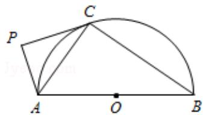

<!-- question-source:start -->
21. (2017·江苏) 如图, AB 为半圆 O 的直径, 直线 PC 切半圆 O 于点 C, AP⊥PC, P

为垂足.

求证：
（1） $\angle PAC = \angle CAB$ ；

(2) $AC^{2}=AP\bullet AB$ .

【
<!-- question-source:end -->

![[高中/真题/按年份分类/2017/2017年江苏高考数学试题及答案/选择题/题目/answers/Q00028691A1.md]]
