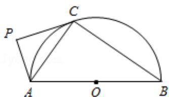

> [!faq]- 2017年江苏高考数学试题及答案解析
>
> > [!success]- **【答案】** 详见解析
>
> > [!note]- **【分析】**
> > （1）利用弦切角定理可得： $\angle ACP = \angle ABC$ 。利用圆的性质可得 $\angle ACB = 90^{\circ}$ 。
>
> > [!note]- **【解析】**
> > 证明：（1）∵直线PC切半圆O于点C，∴∠ACP=∠ABC.
> >
> > ∵AB为半圆O的直径，∴∠ACB=90°.
> >
> > $$
> > \because A P \perp P C, \therefore \angle A P C = 9 0 ^ {\circ}.
> > $$
> >
> > $$
> > \therefore \angle P A C = 9 0 ^ {\circ} - \angle A C P, \angle C A B = 9 0 ^ {\circ} - \angle A B C,
> > $$
> >
> > $\therefore \angle PAC = \angle CAB.$
> > (2) 由
> > (1) 可得: $\triangle APC \sim \triangle ACB$ ,
> >
> > $$
> > \therefore \frac {A C}{A B} = \frac {A P}{A C}.
> > $$
> >
> > $$
> > \therefore A C ^ {2} = A P \bullet A B.
> > $$
> >
> > 
> >
> > 【点评】本题考查了弦切角定理、圆的性质、三角形内角和定理、三角形相似的判
> >
> > 定与性质定理，考查了推理能力与计算能力，属于中档题.
> >
> > [选修 4-2：矩阵与变换]
