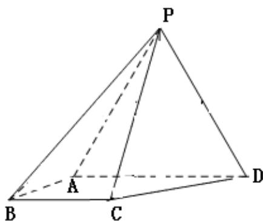

<!-- question-source:start -->
18.(12 分)

如图，四棱锥 P-ABCD 中，侧面 PAD 为等边三角

形且垂直于底面 ABCD， $AB=BC=\frac{1}{2}AD,$

$$
\angle B A D = \angle A B C = 9 0 ^ {\circ}
$$

(1) 证明：直线 BC∥平面 PAD;

(2) 若 $\triangle PAD$ 面积为 $2\sqrt{7}$ , 求四棱锥 P-ABCD 的体积。
<!-- question-source:end -->

![[高中/真题/按年份分类/2017/2017年海南省高考文科数学试题及答案/解答题/题目/answers/Q00026338A1.md]]
