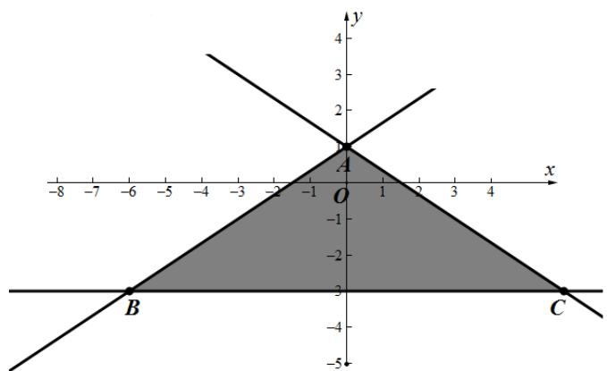

> [!faq]- 2017年海南省高考文科数学试题及答案解析
>
> > [!success]- **【答案】** A
>
> > [!note]- **【分析】**
> > 本题未单列分析。
>
> > [!note]- **【解析】**
> > 绘制不等式组表示的可行域，结合目标函数的几何意义可得函数在点 $B(-6,-3)$ 处取得最小值，最小值为 $z_{\min}=-12-3=-15$ ．故选A.
> >
> > 
