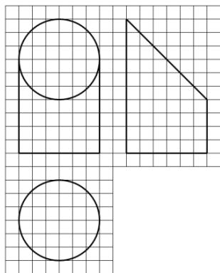
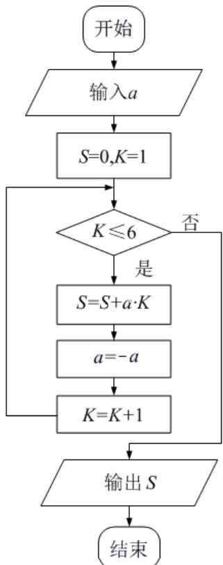

# 2017年普通高等学校招生全国统一考试

# 文科数学

注意事项：

1. 答题前，考生务必将自己的姓名、准考证号填写在本试卷和答题卡相应位置上。

2. 回答选择题时，选出每小题答案后，用铅笔把答题卡上对应题目的答案标号涂黑，如需改动，用橡皮擦干净后，再选涂其它答案标号。回答非选择题时，将答案写在答题卡上。写在本试卷上无效。

3. 考试结束后，将本试卷和答题卡一并交回。

##
一、选择题: 本题共 12 小题, 每小题 5 分, 共 60 分。在每小题给出的四个选项中, 只有一项是符合题目要求的。

1. 设集合 $A=\{1,2,3\}, B=\{2,3,4\}$ ，则 $A \cup B =$ A. $\left\{1\ 2\ 3,4\right\}$ B. $\left\{1\ 2\ 3\right\}$ C. $\left\{2\ 3\ 4\right\}$ D. $\left\{1\ 3\ 4\right\}$ 2. $(1+\mathrm{i})(2+\mathrm{i})=$ A. 1 - i B. $1+3i$ C. $3+i$ D. $3+3i$

3. 函数 $f(x)=\sin(2x+\frac{\pi}{3})$ 的最小正周期为
A. $4\pi$ B. $2\pi$ C. $\pi$ D. $\frac{\pi}{2}$

4. 设非零向量 $a$ ， $b$ 满足 $\left|a + b\right| = \left|a - b\right|$ ，则
A. $a \perp b$ B. $\left|a\right| = \left|b\right|$ C. $a // b$ D. $\left|a\right| > \left|b\right|$

5. 若 $a > 1$ ，则双曲线 $\frac{x^2}{a^2} - y^2 = 1$ 的离心率的取值范围是
A. $(\sqrt{2}, +\infty)$ B. $(\sqrt{2}, 2)$ C. $(1, \sqrt{2})$ D. $(1, 2)$

6. 如图, 网格纸上小正方形的边长为 1 , 粗实线画出的是某几何体的三视图, 该几何体由一平面将一圆柱截去一部分后所得, 则该几何体的体积为
A. $90 \pi$ B. $63 \pi$ C. $42 \pi$ D. $36 \pi$

7. 设满足约束条件 $\left\{ \begin{array}{l} 2x + 3y - 3 \leq 0, \\ 2x - 3y + 3 \geq 0, \\ y + 3 \geq 0, \end{array} \right.$ 则的最小值是 $x, y$ $z = 2x + y$ A. -15 B. -9 C. 1 D. 9

8. 函数 $f(x)=\ln(x^{2}-2x-8)$ 的单调递增区间是
A. $(-∞,-2)$ B. $(-∞,1)$ C. $(1,+∞)$ D. $(4,+∞)$

9. 甲、乙、丙、丁四位同学一起去向老师询问成语竞赛的成绩, 老师说: 你们四人中有 2 位优秀, 2 位良好, 我现在给甲看乙、丙的成绩, 给乙看丙的成绩, 给丁看甲的成绩. 看后甲对大家说: 我还是不知道我的成绩, 根据以上信息, 则
A. 乙可以知道四人的成绩    B. 丁可以知道四人的成绩
C. 乙、丁可以知道对方的成绩 D. 乙、丁可以知道自己的成绩

10. 执行下面的程序框图，如果输入的 $a = -1$ ，则输出的 $S =$

11. 从分别写有 1,2,3,4,5 的 5 张卡片中随机抽取 1 张，放回后再随机抽取 1 张，则抽得的第一张卡片上的数大于第二张卡片上的数的概率为
12. A. $\frac{1}{10}$ B. $\frac{1}{5}$ C. $\frac{3}{10}$ D. $\frac{2}{5}$ 12. 过抛物线 $C:y^{2}=4x$ 的焦点 $F$ ，且斜率为 $\sqrt{3}$ 的直线交 $C_{\text{于点}}M$ （ $M_{\text{在}}x$ 的轴上方）， $l_{\text{为}}C$ 的准线，点 $N_{\text{在}}l_{\text{上且}}MN \perp l_{\text{则}}M_{\text{到直线}}NF$ 的距离为
A. $\sqrt{5}$ B. $2\sqrt{2}$ C. $2\sqrt{3}$ D. $3\sqrt{3}$

##

![[高中/真题/按年份分类/2017/2017年重庆市高考数学试卷_文科_含答案/填空题/填空题.md]]
![[高中/真题/按年份分类/2017/2017年重庆市高考数学试卷_文科_含答案/选择题/选择题.md]]
![[高中/真题/按年份分类/2017/2017年重庆市高考数学试卷_文科_含答案/解答题/解答题.md]]
