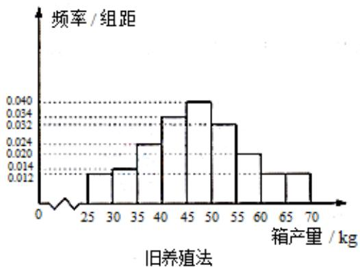
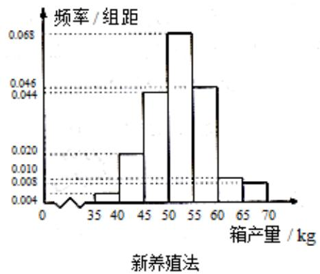

<!-- question-source:start -->
## 19. (12 分)

海水养殖场进行某水产品的新、旧网箱养殖方法的产量对比，收获时各随机抽取了 100 个网箱，测量各箱水产品的产量（单位：kg），其频率分布直方图如下：

<!-- question-source:end -->

![[高中/真题/按年份分类/2017/2017年重庆市高考数学试卷_文科_含答案/填空题/题目/answers/Q00028711A1.md]]
