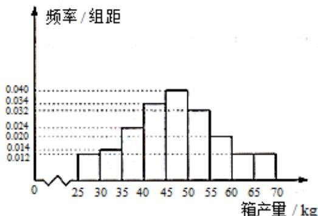
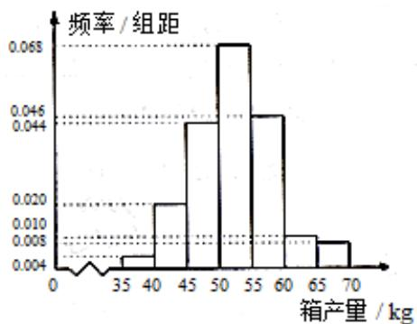

<!-- question-source:start -->
19. (12 分)

海水养殖场进行某水产品的新、旧网箱养殖方法的产量对比，收获时各随机抽取了100个网箱，测量各箱水产品的产量（单位：kg），其频率分布直方图如下：

  
旧养殖法

  
新养殖法  
(1) 记 A 表示事件 “旧养殖法的箱产量低于 50 kg”，估计 A 的概率；

(2) 填写下面列联表，学\*科网并根据列联表判断是否有 $99\%$ 的把握认为箱产量与养殖方法有关：

<table><tr><td></td><td>箱产量&lt;50 kg</td><td>箱产量≥50 kg</td></tr><tr><td>旧养殖法</td><td></td><td></td></tr><tr><td>新养殖法</td><td></td><td></td></tr></table>

(3) 根据箱产量的频率分布直方图，对这两种养殖方法的优劣进行比较.

附：

$$
\begin{array}{c c c c} P \left( \begin{array}{c} K ^ {2} \end{array} \right) & 0. 0 5 0 & 0. 0 1 0 & 0. 0 0 1 \\ \hline k & 3. 8 4 1 & 6. 6 3 5 & 1 0. 8 2 8 \end{array}
$$

$$
K ^ {2} = \frac {n (a d - b c) ^ {2}}{(a + b) (c + d) (a + c) (b + d)}.
$$

【
<!-- question-source:end -->

![[高中/真题/按年份分类/2017/2017年重庆市高考数学试卷_文科_含答案/解答题/题目/answers/Q00025731A1.md]]
