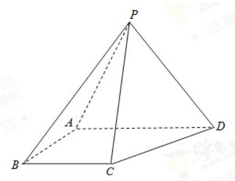

<!-- question-source:start -->
18. (12 分)

如图，四棱锥 $P - ABCD$ 中，侧面 $PAD$ 为等边三角形且垂直于底面 $ABCD$

$$
A B = B C = \frac {1}{2} A D, \angle B A D = \angle A B C = 9 0 ^ {\circ}.
$$

(1) 证明：直线 $BC \parallel$ 平面 $PAD$ ;

(2) 若 $\triangle PCD$ 的面积为 $2\sqrt{7}$ ，求四棱锥 $P - ABCD$ 的体积.

<!-- question-source:end -->

![[高中/真题/按年份分类/2017/2017年重庆市高考数学试卷_文科_含答案/解答题/题目/answers/Q00029806A1.md]]
