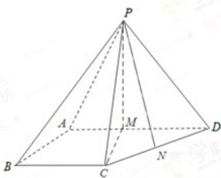

> [!faq]- 2017年重庆市高考数学试卷(文科)含答案解析
>
> > [!success]- **【答案】** 详见解析
>
> > [!note]- **【分析】**
> > 本题未单列分析。
>
> > [!note]- **【解析】**
> > (1) 在平面 $ABCD$ 内, 因为 $\angle BAD = \angle ABC = 90^\circ$ , 所以 $BC \parallel AD$ . 又 $BC \subset$ 平面 $PAD$ , $AD \subset$ 平面 $PAD$ , 故 $BC \parallel$ 平面 $PAD$ .
> >
> > (2) 取 ${AD}$ 的中点 $M$ ,连结 ${PM}$ , ${CM}$ ,由 ${AB} = {BC} = \frac{1}{2}{AD}$ 及 ${BC}//{AD}$ , $\angle {ABC} = {90}^{ \circ  }$ 得四边形 ${ABCM}$ 为正方形,则 ${CM}\bot {AD}$ .
> >
> > 
> >
> > 因为侧面 PAD 为等边三角形且垂直于底面 ABCD，平面 $PAD \cap$ 平面 ABCD = AD，所以 $PM \perp AD$ ， $PM \perp$ 底面 ABCD，因为 $CM \subset$ 底面 ABCD，所以 $PM \perp CM$ 。
> >
> > 设 BC=x，则 $CM=x, CD=\sqrt{2}x, PM=\sqrt{3}x, PC=PD=2x.$ 取 CD 的中点 N，连结 PN，则 $PN \perp CD$ ，所以 $PN = \frac{\sqrt{14}}{2}x$
> >
> > 因为 $\triangle PCD$ 的面积为 $2\sqrt{7}$ ，所以 $\frac{1}{2}\times\sqrt{2}x\times\frac{\sqrt{14}}{2}x=2\sqrt{7}$
> >
> > 解得 x=-2（舍去），x=2，于是 AB=BC=2，AD=4， $PM=2\sqrt{3}$ ，
> >
> > 所以四棱锥 P-ABCD 的体积 $V=\frac{1}{3}\times\frac{2(2+4)}{2}\times2\sqrt{3}=4\sqrt{3}$
