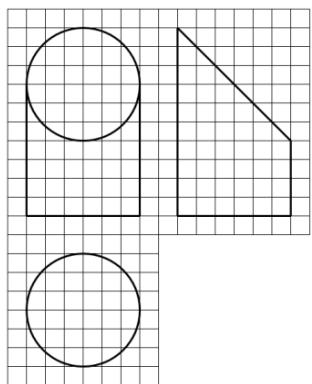

<!-- question-source:start -->
6.如图，网格纸上小正方形的边长为1，粗实线画出的是某几何体的三视图，该几何体由一平面将一圆柱截去一部分后所得，则该几何体的体积为
A. 90π B. 63π C. 42π D. 36π

【
<!-- question-source:end -->

![[高中/真题/按年份分类/2017/2017年重庆市高考数学试卷_文科_含答案/选择题/题目/answers/Q00028702A1.md]]
