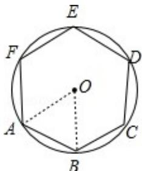

> [!faq]- 2017年高考浙江高考数学试题及答案(精校版)解析
>
> > [!success]- **【答案】** 为: $\frac{3\sqrt{3}}{2}$ .  【点评】本题考查了已知圆的半径求其内接正六边形面积的应用问题, 是基础题.
>
> > [!note]- **【分析】**
> > 根据题意画出图形，结合图形求出单位圆的内接正六边形的面积.
>
> > [!note]- **【解析】**
> > 分析】根据题意画出图形，结合图形求出单位圆的内接正六边形的面积.
> >
> > 【
> > 解答】解：如图所示，
> >
> > 单位圆的半径为 1，则其内接正六边形 ABCDEF 中，
> >
> > $\triangle AOB$ 是边长为 1 的正三角形，
> >
> > 所以正六边形 ABCDEF 的面积为
> >
> > $$
> > S _ {6} = 6 \times \frac {1}{2} \times 1 \times 1 \times \sin 6 0 ^ {\circ} = \frac {3 \sqrt {3}}{2}.
> > $$
> >
> > 故
> > 答案为: $\frac{3\sqrt{3}}{2}$ .
> >
> > 
> >
> > 【点评】本题考查了已知圆的半径求其内接正六边形面积的应用问题, 是基础题.
