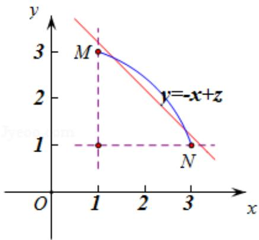
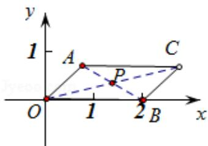

> [!faq]- 2017年高考浙江高考数学试题及答案(精校版)解析
>
> > [!success]- **【答案】** 为：4、 $2\sqrt{5}$ .   【点评】本题考查函数的最值及其几何意义, 考查数形结合能力, 考查运算求解能 力，涉及余弦定理、线性规划等基础知识，注意解题方法的积累，属于中档题.
>
> > [!note]- **【分析】**
> > 通过记 $\angle AOB = \alpha (0\leq \alpha \leq \pi)$ ，利用余弦定理可可知 $|\vec{a} +\vec{b}| = \sqrt{5 - 4\cos\alpha}$ 、 $|\vec{a}$
>
> > [!note]- **【解析】**
> > 分析】通过记 $\angle AOB = \alpha (0\leq \alpha \leq \pi)$ ，利用余弦定理可可知 $|\vec{a} +\vec{b}| = \sqrt{5 - 4\cos\alpha}$ 、 $|\vec{a}$
> >
> > $-\vec{b}| = \sqrt{5 + 4\cos\alpha}$ ，进而换元，转化为线性规划问题，计算即得结论.
> >
> > 【
> > 解答】解：记 $\angle AOB = \alpha$ ，则 $0 \leq \alpha \leq \pi$ ，如图，
> >
> > 由余弦定理可得：
> >
> > $$
> > \left| \vec {a} + \vec {b} \right| = \sqrt {5 - 4 \cos \alpha},
> > $$
> >
> > $$
> > | \vec {a} - \vec {b} | = \sqrt {5 + 4 \cos \alpha},
> > $$
> >
> > 令 $x = \sqrt{5 - 4\cos\alpha}$ ， $y = \sqrt{5 + 4\cos\alpha}$
> >
> > 则 $x^{2}+y^{2}=10$ （x、 $y\geq1$ ），其图象为一段圆弧 MN，如图，
> >
> > 令 $z=x+y$ ，则 $y=-x+z$ ，
> >
> > 则直线 $y = -x + z$ 过 M、N 时 z 最小为 $z_{\min} = 1 + 3 = 3 + 1 = 4$ ，
> >
> > 当直线 $y = -x + z$ 与圆弧 MN 相切时 z 最大，
> >
> > 由平面几何知识易知 $z_{\mathrm{max}}$ 即为原点到切线的距离的 $\sqrt{2}$ 倍，
> >
> > 也就是圆弧 MN 所在圆的半径的 $\sqrt{2}$ 倍，
> >
> > 所以 $z_{\max}=\sqrt{2}\times\sqrt{10}=2\sqrt{5}$ .
> >
> > 综上所述， $|\vec{a} +\vec{b}| + |\vec{a} -\vec{b} |$ 的最小值是4，最大值是 $2\sqrt{5}$
> >
> > 故
> > 答案为：4、 $2\sqrt{5}$ .
> >
> > 
> >
> > 
> >
> > 【点评】本题考查函数的最值及其几何意义, 考查数形结合能力, 考查运算求解能
> > 力，涉及余弦定理、线性规划等基础知识，注意解题方法的积累，属于中档题.
