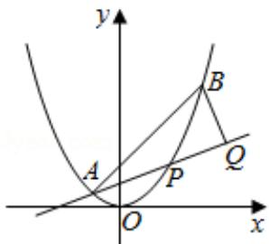

<!-- question-source:start -->
21. (15 分) 如图, 已知抛物线 $x^{2} = y$ , 点 $A(-\frac{1}{2}, \frac{1}{4})$ , $B(\frac{3}{2}, \frac{9}{4})$ , 抛物线上的点 $P(x,$

y) $(- \frac{1}{2} < x < \frac{3}{2})$ ，过点 B 作直线 AP 的垂线，垂足为 Q.

（Ⅰ）求直线 AP 斜率的取值范围；

（II）求 $|PA|\bullet|PQ|$ 的最大值.

<!-- question-source:end -->

![[高中/真题/按年份分类/2017/2017年高考浙江高考数学试题及答案_精校版_/解答题/题目/answers/Q00022776A1.md]]
