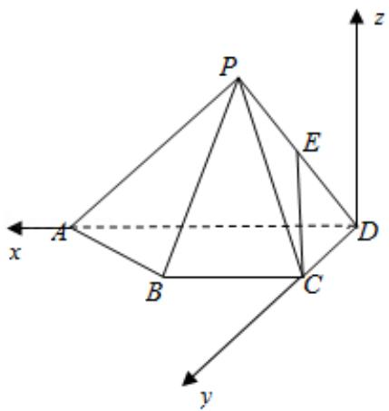

> [!faq]- 2017年高考浙江高考数学试题及答案(精校版)解析
>
> > [!success]- **【答案】** 详见解析
>
> > [!note]- **【分析】**
> > （Ⅰ）以 D 为原点，DA 为 x 轴，DC 为 y 轴，过 D 作平面 ABCD 的垂线为 z 轴，
>
> > [!note]- **【解析】**
> > 分析】（Ⅰ）以 D 为原点，DA 为 x 轴，DC 为 y 轴，过 D 作平面 ABCD 的垂线为 z 轴，
> >
> > 建立空间直角系，利用向量法能证明 CE||平面 PAB.
> >
> > （II）求出平面PBC的法向量和 $\overrightarrow{CE}$ ，利用向量法能求出直线CE与平面PBC所成角
> >
> > 的正弦值.
> >
> > 【
> > 解答】证明: (Ⅰ) ∵ 四棱锥 P-ABCD, △PAD 是以 AD 为斜边的等腰直角三角形,
> >
> > BC∥AD，CD⊥AD，PC=AD=2DC=2CB，E为PD的中点，
> >
> > ∴以 D 为原点，DA 为 x 轴，DC 为 y 轴，过 D 作平面 ABCD 的垂线为 z 轴，建立空间
> >
> > 直角系，
> >
> > 设 PC=AD=2DC=2CB=2，
> >
> > 则 $C(0,1,0), D(0,0,0), P(1,0,1), E(\frac{1}{2}, 0, \frac{1}{2}), A(2,0,0), B(1,1,0)$ ，
> >
> > $\overrightarrow{\mathrm{CE}} = \left(\frac{1}{2}, -1, \frac{1}{2}\right), \overrightarrow{\mathrm{PA}} = (1, 0, -1), \overrightarrow{\mathrm{PB}} = (0, 1, -1)$
> >
> > 设平面 PAB 的法向量 $\vec{n} = (x, y, z)$ ，
> >
> > 则 $\left\{ \begin{array}{l} \overrightarrow{\mathrm{n}} \cdot \overrightarrow{\mathrm{PA}} = \mathrm{x} - \mathrm{z} = 0 \\ \overrightarrow{\mathrm{n}} \cdot \overrightarrow{\mathrm{PB}} = \mathrm{y} - \mathrm{z} = 0 \end{array} \right.$ ，取 $z = 1$ ，得 $\overrightarrow{\mathrm{n}} = (1, 1, 1)$ ，
> >
> > $\because \overrightarrow{CE} \cdot \overrightarrow{n} = \frac{1}{2} - 1 + \frac{1}{2} = 0, \text{ CE } \notin$ 平面 PAB,
> >
> > ∴CE∥平面 PAB.
> >
> > 解：（II） $\overrightarrow{PC} = (-1, 1, -1)$ ，设平面PBC的法向量 $\vec{\pi} = (a, b, c)$ ，
> >
> > 则 $\left\{ \begin{array}{l} \overrightarrow{\mathrm{m}} \cdot \overrightarrow{\mathrm{PB}} = \mathrm{b} - \mathrm{c} = 0 \\ \overrightarrow{\mathrm{m}} \cdot \overrightarrow{\mathrm{PC}} = -\mathrm{a} + \mathrm{b} - \mathrm{c} = 0 \end{array} \right.$ ，取 $b = 1$ ，得 $\overrightarrow{\pi} = (0, 1, 1)$ ，
> >
> > 设直线 CE 与平面 PBC 所成角为 $\theta$ ，
> >
> > 则 $\sin \theta = |\cos < \overrightarrow{\mathrm{CE}},\overrightarrow{\pi} >| = \frac{|\overrightarrow{\mathrm{CE}}\cdot\overrightarrow{\mathrm{m}}|}{|\overrightarrow{\mathrm{CE}}|\cdot|\overrightarrow{\mathrm{m}}|} = \frac{\frac{1}{2}}{\sqrt{\frac{6}{4}}\cdot\sqrt{2}} = \frac{\sqrt{3}}{6}.$
> >
> > ∴直线 CE 与平面 PBC 所成角的正弦值为 $\frac{\sqrt{3}}{6}$ .
> >
> > 
> >
> > 【点评】本题考查线面平行的证明, 考查线面角的正弦值的求法, 考查空间中线线、
> >
> > 线面、面面间的位置关系等基础知识，考查推理论证能力、运算求解能力、空间想
> >
> > 象能力，考查数形结合思想、化归与转化思想，是中档题。
