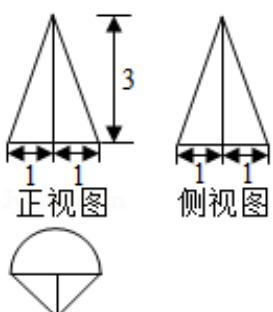

<!-- question-source:start -->
3. （5 分）某几何体的三视图如图所示（单位：cm），则该几何体的体积（单位： $\mathrm{cm}^2$ ）是（ ）

  
俯视图

A. $\frac{\pi}{2} + 1$ B. $\frac{\pi}{2} + 3$ C. $\frac{3\pi}{2} + 1$ D. $\frac{3\pi}{2} + 3$
<!-- question-source:end -->

![[高中/真题/按年份分类/2017/2017年高考浙江高考数学试题及答案_精校版_/选择题/题目/answers/Q00022758A1.md]]
