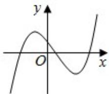
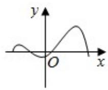
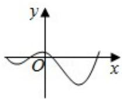
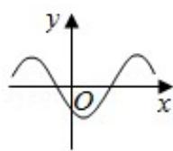
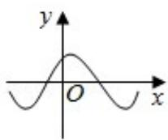

<!-- question-source:start -->
7. (5 分) 函数 $y = f(x)$ 的导函数 $y = f'(x)$ 的图象如图所示, 则函数 $y = f(x)$ 的图象可
能是（）

A.

B.

C.

D.

<!-- question-source:end -->

![[高中/真题/按年份分类/2017/2017年高考浙江高考数学试题及答案_精校版_/选择题/题目/answers/Q00022762A1.md]]
