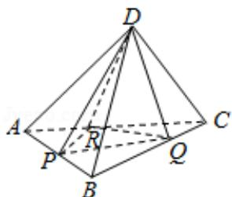

<!-- question-source:start -->
9.（5分）如图，已知正四面体D-ABC（所有棱长均相等的三棱锥），P、Q、R分别为AB、BC、CA上的点，AP=PB, $\frac{BQ}{QC}=\frac{CR}{RA}=2$ ，分别记二面角D-PR-Q，D-PQ-R，D-QR-P的平面角为α、β、γ，则（）

A. $\gamma < a < \beta$ B. $a < \gamma < \beta$ C. $a < \beta < \gamma$ D. $\beta < \gamma < a$
<!-- question-source:end -->

![[高中/真题/按年份分类/2017/2017年高考浙江高考数学试题及答案_精校版_/选择题/题目/answers/Q00022764A1.md]]
