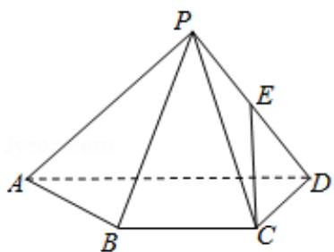

<!-- question-source:start -->
19. (15 分) 如图, 已知四棱锥 P-ABCD, △PAD 是以 AD 为斜边的等腰直角三角形,

BC∥AD，CD⊥AD，PC=AD=2DC=2CB，E为PD的中点.

（Ⅰ）证明：CE∥平面PAB；

（Ⅱ）求直线 CE 与平面 PBC 所成角的正弦值.

<!-- question-source:end -->

![[高中/真题/按年份分类/2017/2017年高考浙江高考数学试题及答案_精校版_/选择题/题目/answers/Q00022774A1.md]]
