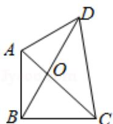

<!-- question-source:start -->
10.（5分）如图，已知平面四边形ABCD，AB⊥BC，AB=BC=AD=2，CD=3，AC与BD交
于点O，记 $I_{1}=\overrightarrow{OA}\cdot\overrightarrow{OB}$ ， $I_{2}=\overrightarrow{OB}\cdot\overrightarrow{OC}$ ， $I_{3}=\overrightarrow{OC}\cdot\overrightarrow{OD}$ ，则（）

A. $I_{1}<I_{2}<I_{3}$ B. $I_{1}<I_{3}<I_{2}$ C. $I_{3}<I_{1}<I_{2}$ D. $I_{2}<I_{1}<I_{3}$

##
二、填空题：本大题共7小题，多空题每题6分，单空题每题4分，共36分
<!-- question-source:end -->

![[高中/真题/按年份分类/2017/2017年高考浙江高考数学试题及答案_精校版_/选择题/题目/answers/Q00028723A1.md]]
