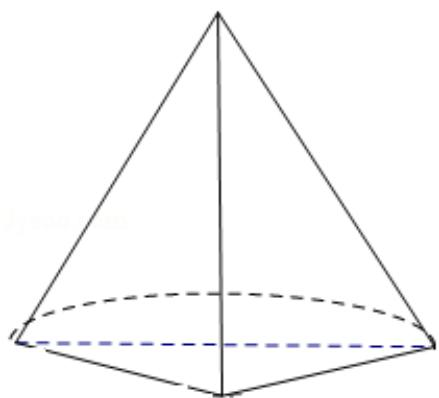

> [!faq]- 2017年高考浙江高考数学试题及答案(精校版)解析
>
> > [!success]- **【答案】** A
>
> > [!note]- **【分析】**
> > 根据几何体的三视图, 该几何体是圆锥的一半和一个三棱锥组成, 画出图形, 结合图中数据即可求出它的体积.
>
> > [!note]- **【解析】**
> > 解：由几何的三视图可知，该几何体是圆锥的一半和一个三棱锥组成，
> >
> > 圆锥的底面圆的半径为 1，三棱锥的底面是底边长 2 的等腰直角三角形，圆锥的
> >
> > 高和棱锥的高相等均为 3，
> >
> > 故该几何体的体积为 $\frac{1}{2} \times \frac{1}{3} \times \pi \times 1^2 \times 3 + \frac{1}{3} \times \frac{1}{2} \times \sqrt{2} \times \sqrt{2} \times 3 = \frac{\pi}{2} + 1,$
> >
> > 故选：A
> >
> > 
> >
> > 【点评】本题考查了空间几何体三视图的应用问题，解题的关键是根据三视图得
> >
> > 出原几何体的结构特征，是基础题目.
