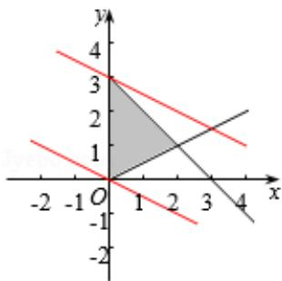

> [!faq]- 2017年高考浙江高考数学试题及答案(精校版)解析
>
> > [!success]- **【答案】** A
>
> > [!note]- **【分析】**
> > 画出约束条件的可行域，利用目标函数的最优解求解即可.
>
> > [!note]- **【解析】**
> > 分析】画出约束条件的可行域，利用目标函数的最优解求解即可.
> >
> > 【
> > 解答】解：x、y 满足约束条件 $\left\{\begin{aligned}x&\geqslant0\\ x+y&-3\geqslant0\\ x&-2y\leqslant0\end{aligned}\right.$ ，表示的可行域如图：
> >
> > 目标函数 $z=x+2y$ 经过坐标原点时，函数取得最小值，
> >
> > 经过 A 时，目标函数取得最大值，
> >
> > 由 $\left\{\begin{aligned}x=0\\ x+y=3\end{aligned}\right.$ 解得A（0，3），
> >
> > 目标函数的直线为：0，最大值为：36
> >
> > 目标函数的范围是[0, 6].
> >
> > 故选：A.
> >
> > 
> >
> > 【点评】本题考查线性规划的简单应用，画出可行域判断目标函数的最优解是解
> >
> > 题的关键.
