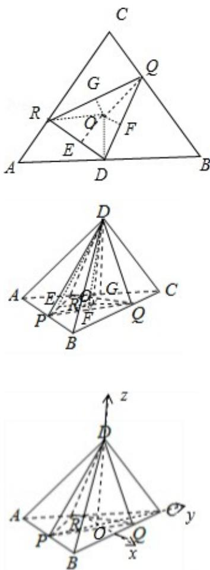

> [!faq]- 2017年高考浙江高考数学试题及答案(精校版)解析
>
> > [!success]- **【答案】** B
>
> > [!note]- **【分析】**
> > 解法一：如图所示，建立空间直角坐标系。设底面△ABC的中心为O。不妨设OP=3。则O(0,0,0)，P(0,-3,0)，C(0,-6,0)，D(0,0,6√2)，Q
> > (√3,2,0)，R(-2√3,0,0)，利用法向量的夹角公式即可得出二面角。
> > 解法二：如图所示，连接OD，OQ，OR，过点O发布作垂线：
> > OE⊥DR，OF⊥DQ，OG⊥QR，垂足分别为E，F，G，连接PE，PF，PG。设OP=h。可得
> > cosα= $\frac{S_{\triangle ODR}}{S_{\triangle PDR}}$ = $\frac{OE}{PE}$ = $\frac{OE}{\sqrt{OE^2+h^2}}$ 。同理可得：cosβ= $\frac{OF}{PF}$ = $\frac{OF}{\sqrt{OF^2+h^2}}$ ，cosγ= $\frac{OG}{PG}$ =$\frac{\mathrm{OG}}{\sqrt{\mathrm{OG}^2 + \mathrm{h}^2}}$ 由已知可得： $\mathrm{OE} > \mathrm{OG} > \mathrm{OF}$ 即可得出.
>
> > [!note]- **【解析】**
> > 分析】解法一：如图所示，建立空间直角坐标系。设底面△ABC的中心为O。不妨设OP=3。则O(0,0,0)，P(0,-3,0)，C(0,-6,0)，D(0,0,6√2)，Q
> > (√3,2,0)，R(-2√3,0,0)，利用法向量的夹角公式即可得出二面角。
> > 解法二：如图所示，连接OD，OQ，OR，过点O发布作垂线：
> > OE⊥DR，OF⊥DQ，OG⊥QR，垂足分别为E，F，G，连接PE，PF，PG。设OP=h。可得
> > cosα= $\frac{S_{\triangle ODR}}{S_{\triangle PDR}}$ = $\frac{OE}{PE}$ = $\frac{OE}{\sqrt{OE^2+h^2}}$ 。同理可得：cosβ= $\frac{OF}{PF}$ = $\frac{OF}{\sqrt{OF^2+h^2}}$ ，cosγ= $\frac{OG}{PG}$ =$\frac{\mathrm{OG}}{\sqrt{\mathrm{OG}^2 + \mathrm{h}^2}}$ 由已知可得： $\mathrm{OE} > \mathrm{OG} > \mathrm{OF}$ 即可得出.
> >
> > 【
> > 解答】解法一：如图所示，建立空间直角坐标系．设底面△ABC 的中心为 O.
> >
> > 不妨设 OP=3. 则 O(0, 0, 0), P(0, -3, 0), C(0, -6, 0), D(0, 0, $6\sqrt{2}$ ),
> >
> > $$
> > Q (\sqrt {3}, 2, 0), R (- 2 \sqrt {3}, 0, 0)
> > $$
> >
> > $$
> > \overrightarrow {\mathrm{PR}} = (- 2 \sqrt {3}, 3, 0), \overrightarrow {\mathrm{PD}} = (0, 3, 6 \sqrt {2}), \overrightarrow {\mathrm{PQ}} = (\sqrt {3}, 5, 0), \overrightarrow {\mathrm{QR}} = (- 3 \sqrt {3}, - 2, 0),
> > $$
> >
> > $$
> > \overrightarrow {Q D} = (- \sqrt {3}, - 2, 6 \sqrt {2})
> > $$
> >
> > 设平面PDR的法向量为 $\vec{\mathrm{n}} = (x, y, z)$ ，则 $\left\{ \begin{array}{l} \vec{\mathrm{n}} \cdot \overrightarrow{\mathrm{PR}} = 0 \\ \vec{\mathrm{n}} \cdot \overrightarrow{\mathrm{PD}} = 0 \end{array} \right.$ ，可得 $\left\{ \begin{array}{l} -2\sqrt{3} x + 3y = 0 \\ 3y + 6\sqrt{2} z = 0 \end{array} \right.$ ，
> >
> > 可得 $\vec{\mathrm{n}} = (\sqrt{6}, 2\sqrt{2}, -1)$ ，取平面ABC的法向量 $\vec{\pi} = (0, 0, 1)$ 。
> >
> > 则 $\cos < \vec{m}, \vec{n} > = \frac{\vec{m} \cdot \vec{n}}{|\vec{m}| |\vec{n}|} = \frac{-1}{\sqrt{15}}$ ，取 $a = \arccos \frac{1}{\sqrt{15}}$ .
> >
> > 同理可得： $\beta = \arccos \frac{3}{\sqrt{681}}$ ， $\gamma = \arccos \frac{\sqrt{2}}{\sqrt{95}}$
> >
> > $$
> > \because \frac {1}{\sqrt {1 5}} > \frac {\sqrt {2}}{\sqrt {9 5}} > \frac {3}{\sqrt {6 8 1}}.
> > $$
> >
> > $$
> > \therefore \alpha <   \gamma <   \beta .
> > $$
> >
> > 解法二：如图所示，连接 OD，OQ，OR，过点 O 发布作垂线：
> >
> > OE⊥DR，OF⊥DQ，OG⊥QR，垂足分别为E，F，G，连接PE，PF，PG.
> >
> > 设 OP=h.
> >
> > 则 $\cos\alpha=\frac{S_{\triangle ODR}}{S_{\triangle PDR}}=\frac{OE}{PE}=\frac{OE}{\sqrt{OE^{2}+h^{2}}}$ .
> >
> > 同理可得： $\cos \beta = \frac{\mathrm{OF}}{\mathrm{PF}} = \frac{\mathrm{OF}}{\sqrt{\mathrm{OF}^2 + \mathrm{h}^2}}$ ， $\cos \gamma = \frac{\mathrm{OG}}{\mathrm{PG}} = \frac{\mathrm{OG}}{\sqrt{\mathrm{OG}^2 + \mathrm{h}^2}}.$
> >
> > 由已知可得：OE>OG>OF.
> >
> > $\therefore \cos\alpha > \cos\gamma > \cos\beta, \alpha, \beta, \gamma$ 为锐角.
> >
> > $$
> > \therefore \alpha <   \gamma <   \beta .
> > $$
> >
> > 故选：B.
> >
> > 
> >
> > 【点评】本题考查了空间角、空间位置关系、正四面体的性质、法向量的夹角公式，
> >
> > 考查了推理能力与计算能力，属于难题.
