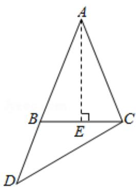

> [!faq]- 2017年高考浙江高考数学试题及答案(精校版)解析
>
> > [!success]- **【答案】** $\frac{\sqrt{15}}{2},\frac{\sqrt{10}}{4}$
>
> > [!note]- **【分析】**
> > 如图, 取 BC 得中点 E, 根据勾股定理求出 AE, 再求出 $S_{\triangle ABC}$ , 再根据 $S_{\triangle BDC} = \frac{1}{2}$
>
> > [!note]- **【解析】**
> > 解：如图，取BC得中点E，
> >
> > ∵AB=AC=4, BC=2,
> >
> > $$
> > \therefore B E = \frac {1}{2} B C = 1, A E \perp B C,
> > $$
> >
> > $$
> > \therefore A E = \sqrt {A B ^ {2} - B E ^ {2}} = \sqrt {1 5},
> > $$
> >
> > $$
> > \therefore S _ {\triangle A B C} = \frac {1}{2} B C \bullet A E = \frac {1}{2} \times 2 \times \sqrt {1 5} = \sqrt {1 5},
> > $$
> >
> > ∵BD=2,
> >
> > $$
> > \therefore S _ {\triangle B D C} = \frac {1}{2} S _ {\triangle A B C} = \frac {\sqrt {1 5}}{2},
> > $$
> >
> > $$
> > \because B C = B D = 2,
> > $$
> >
> > $$
> > \therefore \angle B D C = \angle B C D,
> > $$
> >
> > $$
> > \therefore \angle A B E = 2 \angle B D C
> > $$
> >
> > 在 Rt△ABE 中，
> >
> > $$
> > \because \cos \angle A B E = \frac {B E}{A B} = \frac {1}{4},
> > $$
> >
> > $$
> > \therefore \cos \angle A B E = 2 \cos^ {2} \angle B D C - 1 = \frac {1}{4},
> > $$
> >
> > $$
> > \therefore \cos \angle B D C = \frac {\sqrt {1 0}}{4},
> > $$
> >
> > 故答案为： $\frac{\sqrt{15}}{2},\frac{\sqrt{10}}{4}$
> >
> > 
